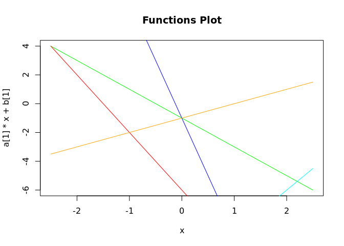
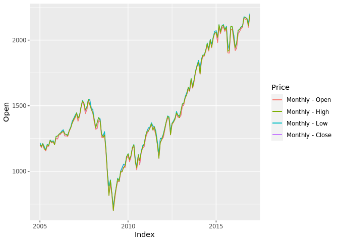
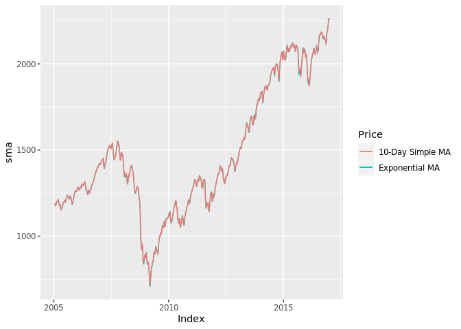

CVXR Practice
================
Alex Kong
2/17/2021

# Solvers

#### (a)

``` r
#is.positive.semi.definite(matrix(c(0.2, 0.1, 0.1, -0.5, 0.1, 0.2, -0.3, 0.1, 0.1), nrow = 3))
#is.positive.semi.definite( L)
cat("Problem 1(a)\n", file = "debug.log")
n <- 3
Sigma <- Variable(rows = n, cols = n, PSD = FALSE)
# PSD: positive semi-definite which is required according to the domain
# help(Variable, CVXR)

w <- c(0.1, 0.2, 0.5) # In R, a vector does not have a dimension by default.
#obj <- quad_form(w, Sigma)
obj <- t(w) %*% Sigma %*% w

# quad_form(x, P) stands for the quadratic form x^TPx
#print(Sigma)

L <- matrix(c(0.2, 0.1, 0.1, -0.5, 0.1, 0.2, -0.3, 0.1, 0.1), nrow = 3, byrow = TRUE)
U <- matrix(c(0.2, 0.7, 0.4, 0.4, 0.1, 0.5, -0.1, 0.5, 0.7), nrow = 3, byrow = TRUE)
cat("L matrix:\n", file = "debug.log", append = TRUE)
for(row in 1:nrow(L)) {
  cat(L[row, ], "\n", file = "debug.log", append = TRUE)
}
cat("U matrix:\n", file = "debug.log", append = TRUE)
for(row in 1:nrow(U)) {
  cat(U[row, ], "\n", file = "debug.log", append = TRUE)
}

print(L)
```

    ##      [,1] [,2] [,3]
    ## [1,]  0.2  0.1  0.1
    ## [2,] -0.5  0.1  0.2
    ## [3,] -0.3  0.1  0.1

``` r
print(U)
```

    ##      [,1] [,2] [,3]
    ## [1,]  0.2  0.7  0.4
    ## [2,]  0.4  0.1  0.5
    ## [3,] -0.1  0.5  0.7

``` r
mylist <- c()
# In R, array indexes start at 1 - the 1st element is at index 1.
for (j in c(1, 2, 3)){ 
  for (k in c(1, 2, 3)) {
#    cat(L[j, k], U[j, k], '\n')
    mylist <- c(mylist, Sigma[j, k] >= L[j, k], Sigma[j, k] <= U[j, k])
  }
}

prob <- Problem(Maximize(obj), constraints = mylist)
# help(Problem, CVXR)
result <- solve(prob)
print(result$status)
```

    ## [1] "optimal"

``` r
cat("status:", result$status, "\n")
```

    ## status: optimal

``` r
print("variable:")
```

    ## [1] "variable:"

``` r
print(result$getValue(Sigma))
```

    ##            [,1]      [,2]      [,3]
    ## [1,]  0.2000000 0.6999997 0.4000002
    ## [2,]  0.3999997 0.1000000 0.4999995
    ## [3,] -0.1000001 0.5000003 0.7000008

``` r
cat("solution:", result$value, "\n")
```

    ## solution: 0.3180002

#### (b)

``` r
#In linear algebra, the trace of a square matrix A, denoted tr(A),[1][2] is defined to be the sum of elements on the main diagonal
# (from the upper left to the lower right) of A.
cat("\nProblem 1(b):\n", file = "debug.log", append = TRUE)
n <- 4
X <- Variable(rows = n, cols = n, PSD = TRUE) # the missing of this PSD is an error
λ_max <- lambda_max(X)
λ_min <- lambda_min(X)
A <- matrix(c(91, 83,  85,  54,
              83, 102, 84,  56,
              85, 84,  150, 72,
              54, 56,  72,  52), nrow = 4, byrow=TRUE)

cat("A matrix:\n", file = "debug.log", append = TRUE)
for(row in 1:nrow(A)) {
  cat(A[row, ], "\n", file = "debug.log", append = TRUE)
}
obj <- λ_max - λ_min

prob <- Problem(Minimize(obj), constraints = c(matrix_trace(X %*% A) == 1))
# help(Problem, CVXR)
result <- solve(prob)
result$getValue(X)
```

    ##              [,1]          [,2]          [,3]         [,4]
    ## [1,] 2.531615e-03  1.375671e-08  2.644915e-09 4.989658e-09
    ## [2,] 1.375671e-08  2.531620e-03 -2.243956e-10 4.039192e-09
    ## [3,] 2.644915e-09 -2.243956e-10  2.531630e-03 7.165318e-09
    ## [4,] 4.989658e-09  4.039192e-09  7.165318e-09 2.531611e-03

#### (c)

``` r
n <- 1
x <- Variable(1)
a <- c(-2, -4, -8, 1, 3)
b <- c(-1, -6, -1, -1, -12)
obj <- max(a[1] * x + b[1], a[2] * x + b[2], a[3] * x + b[3], a[4] * x + b[4], a[5] * x + b[5])

prob <- Problem(Minimize(obj))
# help(Problem, CVXR)
result <- solve(prob)
result$getValue(x)
```

    ## [1] -3.630155e-06

``` r
a <- c(-2, -4, -8, 1, 3)
b <- c(-1, -6, -1, -1, -12)
x <- Variable(1)
objective_c <- Minimize(max_entries(a * x + b))
problem_c <- Problem(objective_c)
result_c <- solve(problem_c)
result_c$getValue(x)
```

    ## [1] -1.899391e-07

``` r
x <- Variable()
t <- Variable()
obj <- t + 0 * x
prob <- Problem(Minimize(obj), constraints = c(t >= a[1] * x + b[1],
                                               t >= a[2] * x + b[2],
                                               t >= a[3] * x + b[3],
                                               t >= a[4] * x + b[4],
                                               t >= a[5] * x + b[5]))
result <- solve(prob)
cat("status:", result$status, "\nvariable:", result$getValue(x), "\nsolution:", result$value, "\n")
```

    ## status: optimal 
    ## variable: -1.899391e-07 
    ## solution: -0.9999997

A sanity check

``` r
x <- seq(-2.5, 2.5, 0.01)
plot(x, a[1] * x + b[1], type="l", col='green', main='Functions Plot')
lines(x, a[2] * x + b[2], col="red")
lines(x, a[3] * x + b[3], col="blue")
lines(x, a[4] * x + b[4], col="orange")
lines(x, a[5] * x + b[5], col="cyan")
```

<!-- -->

# Key packages for finance

#### (a)

``` r
z <- read.zoo("sp500.csv", header = TRUE, sep = ",")
x <- as.xts(z)
#monthly_price <- x[head(endpoints(x, "months") + 1, -1), 'Close']
pl <- ggplot() + 
      geom_line(data=x[head(endpoints(x, "months") + 1, -1), 'Open'], mapping=aes(x=Index, y=Open, color="red")) +
      geom_line(data=x[head(endpoints(x, "months") + 1, -1), 'High'], mapping=aes(x=Index, y=High, color="green")) +
      geom_line(data=x[head(endpoints(x, "months") + 1, -1), 'Low'], mapping=aes(x=Index, y=Low, color="blue")) +
      geom_line(data=x[head(endpoints(x, "months") + 1, -1), 'Close'], mapping=aes(x=Index, y=Close, color="cyan")) +
      
      scale_color_discrete(name = "Price", labels = c("Monthly - Open",
                                                      "Monthly - High",
                                                      "Monthly - Low",
                                                      "Monthly - Close"))
# geom stands for a "geometric object"
pl
```

<!-- -->

#### (b)

``` r
sma <- SMA(x[,'Close'], 10)
ema <- EMA(x[,'Close'])
colnames(sma) <- 'sma'
colnames(ema) <- 'ema'
pl <- ggplot() + 
      geom_line(data = sma, mapping = aes(x = Index, y = sma, color = "red")) +
      geom_line(data = ema, mapping = aes(x = Index, y = ema, color = "green")) +
      scale_color_discrete(name = "Price", labels = c("10-Day Simple MA", "Exponential MA"))
# geom stands for a "geometric object"
pl
```

    ## Warning: Removed 9 row(s) containing missing values (geom_path).

    ## Warning: Removed 9 row(s) containing missing values (geom_path).

<!-- -->

# Elastic net regularization

``` r
cat("\nProblem 3\n", file = "debug.log", append = TRUE)
p <- 200
n <- 500

vec_y <- scan('hw1_y.txt')
mat_X <- scan('hw1_X.txt')
mat_X <- matrix(mat_X, ncol = p, byrow = TRUE)

vec_beta <- Variable(rows=p)
#str(vec_beta)
results <- matrix(c(0, 0, 0, 0,
                   0, 0, 0, 0,
                   0, 0, 0, 0,
                   0, 0, 0, 0), nrow = 4, byrow=TRUE)

λ1 <- c(10^0, 10^2, 10^4, 10^6)
λ2 <- c(10^0, 10^2, 10^4, 10^6)
epsilon <- 10^-3

for (i in seq(1, 4)) { 
  for (j in seq(1, 4)) {
    cat('λ1: ', λ1[i], ', λ2: ', λ2[j], "\n", file = "debug.log", append = TRUE)
    t1 <- sum((vec_y - mat_X %*% vec_beta)^2) # L2 norm
    t2 <- λ1[i] * sum(abs(vec_beta))# L1 norm
    t3 <- λ2[j] * sum((vec_beta) ^ 2)
    #print(cvxr_norm(vec_y - mat_X %*% vec_beta, p = "2"))
    #print(value(cvxr_norm(vec_y - mat_X %*% vec_beta, p = "2")))
    obj <- t1 + t2 + t3
    prob <- Problem(Minimize(obj))
    result <- solve(prob) # help(psolve, CVXR)
    #print(result)
    cat("result$status: ", result$status, "\n", file = "debug.log", append = TRUE)
    beta_star <- (result$getValue(vec_beta))
    
    for (k in seq(1, 200))
      if (abs(beta_star[k]) <= epsilon)
        results[i, j] <- results[i, j] + 1
    
    cat('beta_star: ', beta_star, "\n", file = "debug.log", append = TRUE)
    cat("results matrix: \n", file = "debug.log", append = TRUE)
    for(row in 1:nrow(results)) {
      cat(results[row, ], "\n", file = "debug.log", append = TRUE)
    }
  }

}
print(results)
```

    ##      [,1] [,2] [,3] [,4]
    ## [1,]    0    0    0    0
    ## [2,]    0    0    1    0
    ## [3,]   96   98    8    0
    ## [4,]  141  140   48    0
