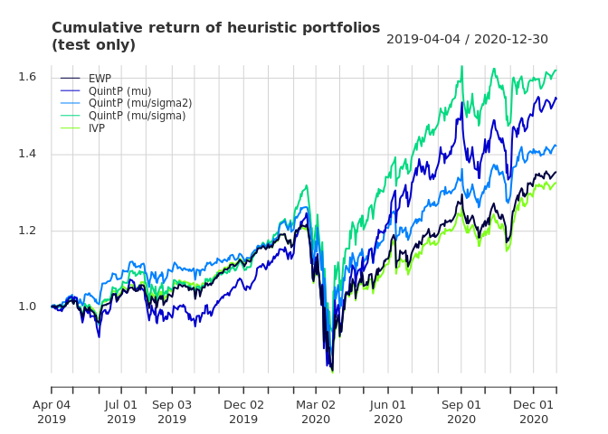
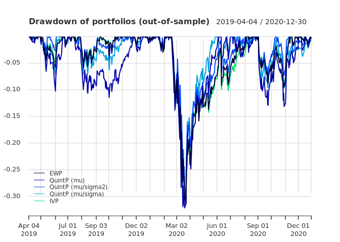

Portfolio Optimization Practice
================
Alex Kong
3/5/2021

``` r
library(xts)  # to manipulate time series of stock data
library(quantmod)  # to download stock data
library(PerformanceAnalytics)  # to compute performance measures
library(CVXR)
#library(psych) 
```

### Portfolio Optimization 1

``` r
stock_namelist <- c('MSFT', 'AAPL', 'AMZN', 'FB', 'GOOG', 'GOOGL', 'JNJ', 'JPM', 
                 'V', 'PG', 'T', 'UNH', 'MA', 'HD', 'INTC', 'VZ', 'KO', 'BAC',
                 'XOM', 'MRK', 'DIS', 'PFE', 'PEP', 'CMCSA', 'CVX', 'ADBE',
                 'CSCO', 'NVDA', 'WMT', 'NFLX', 'CRM', 'WFC', 'MCD', 'ABT',
                 'BMY', 'COST', 'BA', 'C', 'PM', 'NEE', 'MDT', 'ABBV', 'AMGN',
                 'TMO', 'LLY', 'HON', 'ACN', 'IBM')
prices <- xts()
for (i in 1:length(stock_namelist)) {
  tmp <- Ad(getSymbols(Symbols = stock_namelist[i], from = "2014-01-01",
                       to = "2020-12-31", auto.assign = FALSE))
  tmp <- na.approx(tmp, na.rm = FALSE)  # interpolate NAs
 # tmp <- na.approx(tmp, na.rm = TRUE)  # interpolate NAs
  prices <- cbind(prices, tmp)
}
colnames(prices) <- stock_namelist
tclass(prices) <- "Date"

head(x = prices, n = 2)
```

    ##                MSFT     AAPL   AMZN    FB     GOOG    GOOGL      JNJ      JPM
    ## 2014-01-02 32.05732 17.59830 397.97 54.71 554.4817 557.1171 74.70235 47.91782
    ## 2014-01-03 31.84166 17.21174 396.44 54.56 550.4368 553.0530 75.37528 48.28825
    ##                   V       PG        T      UNH       MA       HD     INTC
    ## 2014-01-02 52.56469 64.68571 23.22625 66.48428 79.66444 69.61945 21.08689
    ## 2014-01-03 52.60036 64.61343 23.12656 66.95682 79.34639 69.50909 21.07871
    ##                  VZ       KO      BAC      XOM      MRK      DIS      PFE
    ## 2014-01-02 35.43292 32.16236 14.24059 72.80927 39.63907 70.19250 22.15953
    ## 2014-01-03 35.01351 32.00413 14.51479 72.63411 39.83130 70.04527 22.20318
    ##                 PEP    CMCSA      CVX  ADBE     CSCO     NVDA      WMT     NFLX
    ## 2014-01-02 66.41225 22.56164 91.16424 59.29 17.60511 14.99661 66.81522 51.83143
    ## 2014-01-03 66.52548 22.39500 91.31847 59.16 17.58910 14.81696 66.59506 51.87143
    ##              CRM      WFC      MCD      ABT      BMY     COST       BA        C
    ## 2014-01-02 54.86 35.96897 78.67936 33.06308 43.03624 99.02425 116.8080 46.11103
    ## 2014-01-03 55.12 36.22464 78.78543 33.41767 43.51379 98.58714 117.6199 47.10789
    ##                  PM      NEE      MDT     ABBV     AMGN      TMO      LLY
    ## 2014-01-02 60.61386 17.35486 49.64977 38.63837 96.11830 106.8594 42.27400
    ## 2014-01-03 60.26858 17.37752 50.60390 38.87623 95.01434 107.2687 42.58232
    ##                 HON      ACN      IBM
    ## 2014-01-02 74.07101 70.77936 139.2354
    ## 2014-01-03 74.23505 71.01492 140.0685

``` r
tail(x = prices, n = 2)
```

    ##                MSFT     AAPL    AMZN     FB    GOOG   GOOGL      JNJ      JPM
    ## 2020-12-29 223.6349 134.6688 3322.00 276.78 1758.72 1757.76 153.1848 124.1162
    ## 2020-12-30 221.1706 133.5205 3285.85 271.87 1739.52 1736.25 155.0829 124.4636
    ##                   V       PG        T      UNH       MA       HD     INTC
    ## 2020-12-29 214.0377 137.5901 28.04382 346.1204 346.2211 264.5323 49.09201
    ## 2020-12-30 218.0215 136.9440 27.99469 343.7687 355.0999 263.6081 48.45587
    ##                  VZ       KO      BAC      XOM      MRK    DIS      PFE
    ## 2020-12-29 58.18709 53.68317 29.86168 40.58085 80.71086 177.30 36.65128
    ## 2020-12-30 57.52418 53.99061 29.83183 40.90533 79.88809 181.17 36.34462
    ##                 PEP    CMCSA      CVX   ADBE     CSCO   NVDA    WMT   NFLX
    ## 2020-12-29 146.2522 51.31526 83.43067 502.11 44.28088 517.73 144.30 530.87
    ## 2020-12-30 146.1431 50.97681 84.14063 497.45 44.12217 525.83 144.18 524.59
    ##               CRM      WFC      MCD      ABT      BMY     COST     BA        C
    ## 2020-12-29 222.46 29.68606 211.4092 107.8953 60.93396 371.9855 216.25 60.39518
    ## 2020-12-30 222.40 29.65615 210.2663 108.0049 61.43000 373.7121 216.67 60.34560
    ##               PM      NEE    MDT     ABBV     AMGN      TMO      LLY      HON
    ## 2020-12-29 81.87 74.93681 115.57 103.4896 225.1955 462.5928 165.8872 208.2084
    ## 2020-12-30 81.48 75.51378 115.64 104.0530 225.4933 461.4635 166.3154 210.0204
    ##                 ACN      IBM
    ## 2020-12-29 256.8822 122.1675
    ## 2020-12-30 256.6629 122.7004

``` r
# compute log-returns and linear returns
#X_log <- diff(log(prices))[-1]
#X_lin <- (prices/lag(prices) - 1)[-1]
# or alternatively...
X_log <- CalculateReturns(prices, "log")[-1]
X_lin <- CalculateReturns(prices)[-1]

N <- ncol(X_log)  # number of stocks
TT <- nrow(X_log)  # number of days
#T is a reserved keyword...

T_trn <- round(0.75*TT)  # 75% of data
X_log_trn <- X_log[1:T_trn, ]
X_log_tst <- X_log[(T_trn+1):TT, ]
X_lin_trn <- X_lin[1:T_trn, ]
X_lin_tst <- X_lin[(T_trn+1):TT, ]
```

### Portfolio Optimization 2

``` r
mu_hat <- colMeans(X_log_trn, na.rm = TRUE)
# Note that according to the prof.'s lecture slides, we use linear returns to
# compute performance but we use log return to estimate mu.
Sigma_hat_trn <- cov(X_log_trn)
Sigma_hat_tst <- cov(X_log_tst)

w_EWP <- rep(1/N, N)
names(w_EWP) <- colnames(X_lin)

# create function for IVP
IVP <- function(Sigma) {
  sigma <- sqrt(diag(Sigma))
  w <- 1/sigma
  w <- w/sum(w)
  return(w)
}

# this function can now be used as
w_IVP <- IVP(Sigma_hat_trn)

i1 <- sort(mu_hat, decreasing = TRUE, index.return = TRUE)$ix
i2 <- sort(mu_hat/diag(Sigma_hat_trn), decreasing = TRUE, index.return = TRUE)$ix
i3 <- sort(mu_hat/sqrt(diag(Sigma_hat_trn)), decreasing = TRUE, index.return = TRUE)$ix

# create portfolios
w_QuintP_1 <- w_QuintP_2 <- w_QuintP_3 <- rep(0, N)
w_QuintP_1[i1[1:round(N/5)]] <- 1/round(N/5)
w_QuintP_2[i2[1:round(N/5)]] <- 1/round(N/5)
w_QuintP_3[i3[1:round(N/5)]] <- 1/round(N/5)
w_QuintP <- cbind("QuintP (mu)"        = w_QuintP_1, 
                  "QuintP (mu/sigma2)" = w_QuintP_2, 
                  "QuintP (mu/sigma)"  = w_QuintP_3)
rownames(w_QuintP) <- colnames(X_lin)
#w_QuintP

w_heuristic <- cbind("EWP" = w_EWP, w_QuintP, "IVP" = w_IVP)

# compute returns of all portfolios
ret_heuristic <- xts(X_lin %*% w_heuristic, order.by = index(X_lin))
# X_lin or X_log? This code is from page 88 of lec3_portfolio-optimization.html

ret_heuristic_trn <- ret_heuristic[1:T_trn, ]
ret_heuristic_tst <- ret_heuristic[-c(1:T_trn), ]

# performance
t(table.AnnualizedReturns(ret_heuristic_trn))
```

    ##                    Annualized Return Annualized Std Dev
    ## EWP                           0.1799             0.1346
    ## QuintP (mu)                   0.3525             0.1941
    ## QuintP (mu/sigma2)            0.2141             0.1266
    ## QuintP (mu/sigma)             0.3065             0.1591
    ## IVP                           0.1642             0.1276
    ##                    Annualized Sharpe (Rf=0%)
    ## EWP                                   1.3371
    ## QuintP (mu)                           1.8159
    ## QuintP (mu/sigma2)                    1.6913
    ## QuintP (mu/sigma)                     1.9263
    ## IVP                                   1.2868

``` r
chart.CumReturns(R = ret_heuristic_tst,
                 main = "Cumulative return of heuristic portfolios\n(test only)", 
                 wealth.index = TRUE, legend.loc = "topleft",
                 colorset = rich8equal)
```

<!-- -->

``` r
chart.Drawdown(ret_heuristic_tst, main = "Drawdown of portfolios (out-of-sample)", 
               legend.loc = "bottomleft", colorset = rich10equal)
```

<!-- -->

### Portfolio Optimization 3

``` r
# create function for GMVP
GMVP <- function(Sigma) {
  w <- Variable(nrow(Sigma))
  prob <- Problem(Minimize(quad_form(w, Sigma)),
                  constraints = list(w >= 0, sum(w) == 1))
  result <- solve(prob)
  w <- as.vector(result$getValue(w))
  names(w) <- colnames(Sigma)
  return(w)
}

fn_SR <- function(w) {
  return(as.numeric(t(w) %*% mu_hat / sqrt(t(w) %*% Sigma_hat_tst %*% w)))
}

#Sigma_hat_trn <- Sigma
for (rho in seq(from = 0, to = 1, by = 0.2)) {
  w <- Variable(cols = N)
  Sigma <- rho * Sigma_hat_trn + (1 - rho) * sum(diag(Sigma_hat_trn)) * diag(N) / N
  w_GMVP <- GMVP(Sigma)
  ret_GMVP <- xts(X_lin_tst %*% w_GMVP, index(X_lin_tst))
#  print(paste0("rho: ", rho, ", w_GMWP:", round(fn_SR(w_GMVP), 10)))
  print(SharpeRatio(ret_GMVP))
}
```

    ##                                     [,1]
    ## StdDev Sharpe (Rf=0%, p=95%): 0.04954134
    ## VaR Sharpe (Rf=0%, p=95%):    0.03410685
    ## ES Sharpe (Rf=0%, p=95%):     0.01960323
    ##                                     [,1]
    ## StdDev Sharpe (Rf=0%, p=95%): 0.04489360
    ## VaR Sharpe (Rf=0%, p=95%):    0.03127213
    ## ES Sharpe (Rf=0%, p=95%):     0.01978316
    ##                                     [,1]
    ## StdDev Sharpe (Rf=0%, p=95%): 0.04509502
    ## VaR Sharpe (Rf=0%, p=95%):    0.03140908
    ## ES Sharpe (Rf=0%, p=95%):     0.01983419
    ##                                     [,1]
    ## StdDev Sharpe (Rf=0%, p=95%): 0.04563553
    ## VaR Sharpe (Rf=0%, p=95%):    0.03179115
    ## ES Sharpe (Rf=0%, p=95%):     0.01999764
    ##                                     [,1]
    ## StdDev Sharpe (Rf=0%, p=95%): 0.04596246
    ## VaR Sharpe (Rf=0%, p=95%):    0.03202904
    ## ES Sharpe (Rf=0%, p=95%):     0.02014749
    ##                                     [,1]
    ## StdDev Sharpe (Rf=0%, p=95%): 0.04637276
    ## VaR Sharpe (Rf=0%, p=95%):    0.03218656
    ## ES Sharpe (Rf=0%, p=95%):     0.01978103

### Portfolio Optimization 4

``` r
M <- 10

Sigma1  <- (1 - 1)  / (M - 1) * Sigma_hat_trn + (M - 1)  / (M - 1) * (sum(diag(Sigma_hat_trn)) * diag(N)) / (N)
Sigma2  <- (2 - 1)  / (M - 1) * Sigma_hat_trn + (M - 2)  / (M - 1) * (sum(diag(Sigma_hat_trn)) * diag(N)) / (N)
Sigma3  <- (3 - 1)  / (M - 1) * Sigma_hat_trn + (M - 3)  / (M - 1) * (sum(diag(Sigma_hat_trn)) * diag(N)) / (N)
Sigma4  <- (4 - 1)  / (M - 1) * Sigma_hat_trn + (M - 4)  / (M - 1) * (sum(diag(Sigma_hat_trn)) * diag(N)) / (N)
Sigma5  <- (5 - 1)  / (M - 1) * Sigma_hat_trn + (M - 5)  / (M - 1) * (sum(diag(Sigma_hat_trn)) * diag(N)) / (N)
Sigma6  <- (6 - 1)  / (M - 1) * Sigma_hat_trn + (M - 6)  / (M - 1) * (sum(diag(Sigma_hat_trn)) * diag(N)) / (N)
Sigma7  <- (7 - 1)  / (M - 1) * Sigma_hat_trn + (M - 7)  / (M - 1) * (sum(diag(Sigma_hat_trn)) * diag(N)) / (N)
Sigma8  <- (8 - 1)  / (M - 1) * Sigma_hat_trn + (M - 8)  / (M - 1) * (sum(diag(Sigma_hat_trn)) * diag(N)) / (N)
Sigma9  <- (9 - 1)  / (M - 1) * Sigma_hat_trn + (M - 9)  / (M - 1) * (sum(diag(Sigma_hat_trn)) * diag(N)) / (N)
Sigma10 <- (10 - 1) / (M - 1) * Sigma_hat_trn + (M - 10) / (M - 1) * (sum(diag(Sigma_hat_trn)) * diag(N)) / (N)
Sigma10
```

    ##               MSFT         AAPL         AMZN           FB         GOOG
    ## MSFT  2.113520e-04 1.187843e-04 1.516307e-04 1.257207e-04 1.378764e-04
    ## AAPL  1.187843e-04 2.366864e-04 1.313753e-04 1.198412e-04 1.099215e-04
    ## AMZN  1.516307e-04 1.313753e-04 3.768562e-04 1.995915e-04 1.798877e-04
    ## FB    1.257207e-04 1.198412e-04 1.995915e-04 3.627386e-04 1.677351e-04
    ## GOOG  1.378764e-04 1.099215e-04 1.798877e-04 1.677351e-04 2.155003e-04
    ## GOOGL 1.351907e-04 1.088680e-04 1.790265e-04 1.685770e-04 2.123394e-04
    ## JNJ   5.758541e-05 4.760668e-05 5.520221e-05 5.172590e-05 5.439714e-05
    ## JPM   9.199090e-05 8.085027e-05 8.711805e-05 8.405119e-05 8.117373e-05
    ## V     1.146253e-04 9.697016e-05 1.371918e-04 1.174954e-04 1.115418e-04
    ## PG    4.859194e-05 3.928519e-05 3.648180e-05 3.288638e-05 3.822083e-05
    ## T     4.541208e-05 3.883004e-05 4.001807e-05 3.170417e-05 4.028235e-05
    ## UNH   8.039763e-05 7.433228e-05 8.575305e-05 7.059032e-05 7.498741e-05
    ## MA    1.248054e-04 1.103677e-04 1.561279e-04 1.354332e-04 1.219265e-04
    ## HD    7.706834e-05 7.037650e-05 8.714368e-05 7.923607e-05 7.443749e-05
    ## INTC  1.314290e-04 1.041983e-04 1.081293e-04 1.062607e-04 1.011751e-04
    ## VZ    4.803436e-05 2.946090e-05 3.038765e-05 3.176030e-05 3.403790e-05
    ## KO    4.227563e-05 3.037044e-05 3.590156e-05 3.465409e-05 3.423354e-05
    ## BAC   9.921808e-05 8.683042e-05 1.046172e-04 1.014865e-04 9.455931e-05
    ## XOM   6.485210e-05 5.914638e-05 6.374923e-05 5.603958e-05 5.967087e-05
    ## MRK   6.025137e-05 5.156087e-05 4.788301e-05 5.743172e-05 5.884174e-05
    ## DIS   6.957783e-05 6.719871e-05 7.829343e-05 7.226738e-05 6.594307e-05
    ## PFE   6.333266e-05 5.414938e-05 5.993880e-05 5.941685e-05 5.978120e-05
    ## PEP   4.562215e-05 3.928413e-05 3.949424e-05 4.395421e-05 3.863197e-05
    ## CMCSA 7.440682e-05 6.448410e-05 6.875731e-05 6.286029e-05 6.770539e-05
    ## CVX   7.796692e-05 6.521198e-05 7.398072e-05 6.839997e-05 6.302639e-05
    ## ADBE  1.501521e-04 1.168020e-04 1.676783e-04 1.550005e-04 1.366135e-04
    ## CSCO  1.119473e-04 9.749701e-05 1.086068e-04 8.668840e-05 9.245662e-05
    ## NVDA  1.673472e-04 1.534131e-04 1.905586e-04 1.782444e-04 1.593440e-04
    ## WMT   4.832787e-05 4.319773e-05 4.361274e-05 3.322995e-05 4.012143e-05
    ## NFLX  1.590916e-04 1.383726e-04 2.398785e-04 2.025076e-04 1.858873e-04
    ## CRM   1.481442e-04 1.246651e-04 1.813151e-04 1.764914e-04 1.439924e-04
    ## WFC   7.909959e-05 6.618216e-05 7.585108e-05 6.799525e-05 7.146144e-05
    ## MCD   5.649010e-05 4.461493e-05 5.319384e-05 4.939404e-05 4.768023e-05
    ## ABT   9.115962e-05 8.139067e-05 9.143478e-05 7.487941e-05 8.630133e-05
    ## BMY   6.384157e-05 6.547168e-05 7.188682e-05 7.618314e-05 6.261683e-05
    ## COST  6.440754e-05 6.046208e-05 7.275760e-05 5.250069e-05 6.092888e-05
    ## BA    9.039984e-05 9.575932e-05 1.062589e-04 8.837526e-05 8.570381e-05
    ## C     1.042813e-04 9.328325e-05 1.065192e-04 9.653819e-05 9.725192e-05
    ## PM    4.903589e-05 4.849927e-05 4.573812e-05 3.934733e-05 4.526343e-05
    ## NEE   3.389662e-05 2.317411e-05 2.734181e-05 2.980158e-05 2.700720e-05
    ## MDT   7.298365e-05 6.318499e-05 7.457131e-05 7.430547e-05 7.348768e-05
    ## ABBV  9.298353e-05 6.820843e-05 9.315018e-05 9.010558e-05 9.173855e-05
    ## AMGN  9.333712e-05 8.386715e-05 1.031709e-04 1.030774e-04 9.789526e-05
    ## TMO   9.786382e-05 8.214006e-05 9.979515e-05 8.817294e-05 9.214157e-05
    ## LLY   6.613677e-05 4.909596e-05 5.592177e-05 6.047347e-05 6.434590e-05
    ## HON   8.612405e-05 7.368483e-05 7.669838e-05 7.870055e-05 7.839345e-05
    ## ACN   1.037197e-04 8.317690e-05 1.000814e-04 9.101896e-05 8.798108e-05
    ## IBM   8.630429e-05 6.951321e-05 7.606546e-05 6.583579e-05 7.624320e-05
    ##              GOOGL          JNJ          JPM            V           PG
    ## MSFT  1.351907e-04 5.758541e-05 9.199090e-05 1.146253e-04 4.859194e-05
    ## AAPL  1.088680e-04 4.760668e-05 8.085027e-05 9.697016e-05 3.928519e-05
    ## AMZN  1.790265e-04 5.520221e-05 8.711805e-05 1.371918e-04 3.648180e-05
    ## FB    1.685770e-04 5.172590e-05 8.405119e-05 1.174954e-04 3.288638e-05
    ## GOOG  2.123394e-04 5.439714e-05 8.117373e-05 1.115418e-04 3.822083e-05
    ## GOOGL 2.131006e-04 5.487014e-05 7.995393e-05 1.120343e-04 3.808717e-05
    ## JNJ   5.487014e-05 1.004158e-04 5.478888e-05 5.598067e-05 4.207931e-05
    ## JPM   7.995393e-05 5.478888e-05 1.702330e-04 8.861440e-05 3.630132e-05
    ## V     1.120343e-04 5.598067e-05 8.861440e-05 1.728603e-04 4.074984e-05
    ## PG    3.808717e-05 4.207931e-05 3.630132e-05 4.074984e-05 8.624920e-05
    ## T     4.062530e-05 3.943651e-05 4.952862e-05 3.721468e-05 3.541014e-05
    ## UNH   7.465628e-05 5.514365e-05 7.644055e-05 7.477232e-05 3.534950e-05
    ## MA    1.218912e-04 5.968218e-05 9.640406e-05 1.552901e-04 4.285762e-05
    ## HD    7.396252e-05 4.660720e-05 7.398382e-05 7.900639e-05 3.682703e-05
    ## INTC  9.994429e-05 5.605387e-05 9.111821e-05 9.337332e-05 4.416959e-05
    ## VZ    3.428689e-05 4.308022e-05 4.334448e-05 3.318769e-05 3.958392e-05
    ## KO    3.509322e-05 3.716944e-05 3.287279e-05 3.579203e-05 4.669100e-05
    ## BAC   9.280496e-05 5.158417e-05 1.816123e-04 1.031569e-04 3.188815e-05
    ## XOM   5.952447e-05 5.032000e-05 7.819125e-05 6.233368e-05 4.018912e-05
    ## MRK   5.869471e-05 6.352846e-05 6.565571e-05 5.998560e-05 4.029646e-05
    ## DIS   6.611460e-05 4.240708e-05 7.453635e-05 7.068679e-05 3.652629e-05
    ## PFE   5.917809e-05 6.007313e-05 6.574688e-05 6.390014e-05 3.576200e-05
    ## PEP   3.962368e-05 4.532223e-05 3.480366e-05 4.271729e-05 5.097579e-05
    ## CMCSA 6.794739e-05 4.664342e-05 7.667876e-05 6.594922e-05 3.969741e-05
    ## CVX   6.214211e-05 5.078053e-05 9.065785e-05 7.132803e-05 4.216670e-05
    ## ADBE  1.372721e-04 6.344487e-05 8.835720e-05 1.368186e-04 3.453494e-05
    ## CSCO  9.227588e-05 5.889336e-05 8.903163e-05 9.226762e-05 4.298258e-05
    ## NVDA  1.587432e-04 5.507949e-05 1.097698e-04 1.472291e-04 4.255680e-05
    ## WMT   3.975106e-05 4.029400e-05 4.341552e-05 4.278656e-05 4.127786e-05
    ## NFLX  1.835375e-04 4.779627e-05 1.042963e-04 1.380035e-04 3.531985e-05
    ## CRM   1.462428e-04 5.728275e-05 1.017960e-04 1.447138e-04 3.654157e-05
    ## WFC   7.041141e-05 5.218374e-05 1.317303e-04 7.904170e-05 3.060745e-05
    ## MCD   4.728696e-05 4.110097e-05 4.716474e-05 4.832750e-05 3.494256e-05
    ## ABT   8.723221e-05 6.571020e-05 8.244479e-05 9.275692e-05 3.908064e-05
    ## BMY   6.272983e-05 6.578876e-05 6.733412e-05 7.634267e-05 3.670650e-05
    ## COST  6.137277e-05 4.587893e-05 5.372280e-05 5.622693e-05 3.826884e-05
    ## BA    8.547032e-05 5.871506e-05 9.797955e-05 9.377223e-05 4.179733e-05
    ## C     9.630229e-05 5.775040e-05 1.722740e-04 1.079646e-04 3.767859e-05
    ## PM    4.569962e-05 4.355621e-05 3.557925e-05 4.190562e-05 5.362539e-05
    ## NEE   2.809665e-05 3.217117e-05 1.129171e-05 2.951286e-05 3.708100e-05
    ## MDT   7.290898e-05 5.945379e-05 6.055721e-05 7.541428e-05 3.424788e-05
    ## ABBV  9.166065e-05 7.687040e-05 7.943827e-05 8.125248e-05 3.648206e-05
    ## AMGN  9.726455e-05 7.674969e-05 9.390090e-05 9.267613e-05 4.333379e-05
    ## TMO   9.162181e-05 6.446524e-05 8.677012e-05 9.678939e-05 3.768349e-05
    ## LLY   6.354833e-05 6.410777e-05 5.936829e-05 6.092565e-05 3.874471e-05
    ## HON   7.826138e-05 5.274891e-05 8.383999e-05 8.072870e-05 3.637152e-05
    ## ACN   8.775144e-05 5.741304e-05 8.376189e-05 9.318794e-05 4.004454e-05
    ## IBM   7.607994e-05 4.703417e-05 7.606086e-05 7.323708e-05 4.175724e-05
    ##                  T          UNH           MA           HD         INTC
    ## MSFT  4.541208e-05 8.039763e-05 1.248054e-04 7.706834e-05 1.314290e-04
    ## AAPL  3.883004e-05 7.433228e-05 1.103677e-04 7.037650e-05 1.041983e-04
    ## AMZN  4.001807e-05 8.575305e-05 1.561279e-04 8.714368e-05 1.081293e-04
    ## FB    3.170417e-05 7.059032e-05 1.354332e-04 7.923607e-05 1.062607e-04
    ## GOOG  4.028235e-05 7.498741e-05 1.219265e-04 7.443749e-05 1.011751e-04
    ## GOOGL 4.062530e-05 7.465628e-05 1.218912e-04 7.396252e-05 9.994429e-05
    ## JNJ   3.943651e-05 5.514365e-05 5.968218e-05 4.660720e-05 5.605387e-05
    ## JPM   4.952862e-05 7.644055e-05 9.640406e-05 7.398382e-05 9.111821e-05
    ## V     3.721468e-05 7.477232e-05 1.552901e-04 7.900639e-05 9.337332e-05
    ## PG    3.541014e-05 3.534950e-05 4.285762e-05 3.682703e-05 4.416959e-05
    ## T     1.220088e-04 3.914362e-05 4.152738e-05 4.317014e-05 4.746019e-05
    ## UNH   3.914362e-05 1.699892e-04 8.102799e-05 6.515212e-05 7.077408e-05
    ## MA    4.152738e-05 8.102799e-05 1.940168e-04 8.325594e-05 1.039059e-04
    ## HD    4.317014e-05 6.515212e-05 8.325594e-05 1.360371e-04 7.243825e-05
    ## INTC  4.746019e-05 7.077408e-05 1.039059e-04 7.243825e-05 2.437778e-04
    ## VZ    7.589368e-05 3.422275e-05 3.389744e-05 4.060099e-05 4.498836e-05
    ## KO    3.359903e-05 3.138720e-05 3.727092e-05 3.452605e-05 3.944143e-05
    ## BAC   4.581004e-05 8.577825e-05 1.111225e-04 7.980661e-05 1.012049e-04
    ## XOM   4.862634e-05 5.268247e-05 7.060302e-05 5.011582e-05 7.288098e-05
    ## MRK   4.440243e-05 5.969640e-05 6.100431e-05 4.783248e-05 6.296667e-05
    ## DIS   4.871814e-05 5.637213e-05 7.498139e-05 5.979370e-05 7.337969e-05
    ## PFE   3.904493e-05 6.698293e-05 6.589583e-05 5.284674e-05 6.204272e-05
    ## PEP   3.473475e-05 3.580285e-05 4.255459e-05 4.134707e-05 4.388711e-05
    ## CMCSA 6.159859e-05 6.020389e-05 6.918689e-05 6.070616e-05 7.276480e-05
    ## CVX   5.004502e-05 5.915680e-05 7.959592e-05 5.825708e-05 7.949322e-05
    ## ADBE  3.485447e-05 8.732716e-05 1.456251e-04 8.443327e-05 1.143641e-04
    ## CSCO  5.070816e-05 6.465212e-05 1.042052e-04 7.035539e-05 1.133963e-04
    ## NVDA  4.984286e-05 9.119372e-05 1.718067e-04 1.000888e-04 1.806279e-04
    ## WMT   4.206167e-05 4.900629e-05 4.621524e-05 5.391113e-05 4.550105e-05
    ## NFLX  4.194352e-05 1.027402e-04 1.574398e-04 9.456553e-05 1.393610e-04
    ## CRM   4.120657e-05 8.555301e-05 1.575472e-04 9.332043e-05 1.175346e-04
    ## WFC   4.659472e-05 6.883571e-05 8.279657e-05 6.713779e-05 7.772021e-05
    ## MCD   3.004352e-05 4.224996e-05 5.162647e-05 4.621226e-05 4.430093e-05
    ## ABT   3.925312e-05 7.942163e-05 9.730316e-05 6.860167e-05 8.918783e-05
    ## BMY   3.328065e-05 6.854417e-05 8.247134e-05 5.415732e-05 6.756891e-05
    ## COST  3.694050e-05 4.837619e-05 5.954092e-05 6.389736e-05 5.938317e-05
    ## BA    4.960670e-05 7.506337e-05 1.034457e-04 7.413522e-05 9.477512e-05
    ## C     5.202756e-05 8.682729e-05 1.179483e-04 8.209293e-05 1.037220e-04
    ## PM    4.406756e-05 4.656092e-05 4.468942e-05 4.009524e-05 4.586794e-05
    ## NEE   3.043385e-05 3.115093e-05 3.026044e-05 2.667553e-05 3.336773e-05
    ## MDT   3.244720e-05 7.409583e-05 7.791534e-05 5.693187e-05 7.195651e-05
    ## ABBV  4.162307e-05 8.840433e-05 8.933233e-05 7.039636e-05 9.733264e-05
    ## AMGN  4.570961e-05 9.418029e-05 9.910617e-05 7.516258e-05 9.608273e-05
    ## TMO   3.792090e-05 8.455795e-05 1.015360e-04 7.262760e-05 9.103496e-05
    ## LLY   4.060152e-05 6.342275e-05 6.421419e-05 4.614065e-05 5.856849e-05
    ## HON   4.478130e-05 6.403064e-05 8.684069e-05 6.807372e-05 8.124645e-05
    ## ACN   4.514247e-05 6.956373e-05 1.013012e-04 7.176091e-05 9.333474e-05
    ## IBM   4.822761e-05 5.619475e-05 7.975541e-05 6.030295e-05 8.280202e-05
    ##                 VZ           KO           BAC          XOM          MRK
    ## MSFT  4.803436e-05 4.227563e-05  9.921808e-05 6.485210e-05 6.025137e-05
    ## AAPL  2.946090e-05 3.037044e-05  8.683042e-05 5.914638e-05 5.156087e-05
    ## AMZN  3.038765e-05 3.590156e-05  1.046172e-04 6.374923e-05 4.788301e-05
    ## FB    3.176030e-05 3.465409e-05  1.014865e-04 5.603958e-05 5.743172e-05
    ## GOOG  3.403790e-05 3.423354e-05  9.455931e-05 5.967087e-05 5.884174e-05
    ## GOOGL 3.428689e-05 3.509322e-05  9.280496e-05 5.952447e-05 5.869471e-05
    ## JNJ   4.308022e-05 3.716944e-05  5.158417e-05 5.032000e-05 6.352846e-05
    ## JPM   4.334448e-05 3.287279e-05  1.816123e-04 7.819125e-05 6.565571e-05
    ## V     3.318769e-05 3.579203e-05  1.031569e-04 6.233368e-05 5.998560e-05
    ## PG    3.958392e-05 4.669100e-05  3.188815e-05 4.018912e-05 4.029646e-05
    ## T     7.589368e-05 3.359903e-05  4.581004e-05 4.862634e-05 4.440243e-05
    ## UNH   3.422275e-05 3.138720e-05  8.577825e-05 5.268247e-05 5.969640e-05
    ## MA    3.389744e-05 3.727092e-05  1.111225e-04 7.060302e-05 6.100431e-05
    ## HD    4.060099e-05 3.452605e-05  7.980661e-05 5.011582e-05 4.783248e-05
    ## INTC  4.498836e-05 3.944143e-05  1.012049e-04 7.288098e-05 6.296667e-05
    ## VZ    1.137061e-04 3.921410e-05  3.766501e-05 4.171018e-05 4.718383e-05
    ## KO    3.921410e-05 8.065980e-05  2.921584e-05 3.441681e-05 3.643005e-05
    ## BAC   3.766501e-05 2.921584e-05  2.566407e-04 8.000967e-05 6.894468e-05
    ## XOM   4.171018e-05 3.441681e-05  8.000967e-05 1.378305e-04 5.467721e-05
    ## MRK   4.718383e-05 3.643005e-05  6.894468e-05 5.467721e-05 1.496229e-04
    ## DIS   4.157097e-05 3.208252e-05  8.430859e-05 5.679475e-05 4.786006e-05
    ## PFE   3.768130e-05 3.093656e-05  6.722502e-05 5.077424e-05 7.804687e-05
    ## PEP   4.220682e-05 5.471965e-05  2.876154e-05 3.527543e-05 4.100100e-05
    ## CMCSA 5.272502e-05 3.413248e-05  7.798448e-05 6.042773e-05 5.663491e-05
    ## CVX   4.608698e-05 3.741669e-05  9.549442e-05 1.253960e-04 5.698946e-05
    ## ADBE  3.325179e-05 4.071796e-05  1.041851e-04 5.836809e-05 6.362175e-05
    ## CSCO  4.534442e-05 3.681527e-05  9.645209e-05 6.832989e-05 6.376478e-05
    ## NVDA  3.404008e-05 3.407825e-05  1.320305e-04 7.211413e-05 5.175290e-05
    ## WMT   4.098041e-05 3.446222e-05  3.966028e-05 3.573682e-05 4.431746e-05
    ## NFLX  2.731939e-05 3.689591e-05  1.290397e-04 6.519791e-05 7.675348e-05
    ## CRM   3.331591e-05 3.689908e-05  1.248442e-04 6.520272e-05 7.027334e-05
    ## WFC   4.058448e-05 3.074069e-05  1.557347e-04 7.013120e-05 5.742845e-05
    ## MCD   3.498237e-05 3.571937e-05  4.799105e-05 3.740215e-05 3.924365e-05
    ## ABT   4.340165e-05 3.695397e-05  8.982916e-05 5.942009e-05 7.761720e-05
    ## BMY   2.983298e-05 3.205397e-05  7.112818e-05 4.594292e-05 5.303477e-05
    ## COST  3.679237e-05 3.476177e-05  5.507322e-05 4.172658e-05 4.344411e-05
    ## BA    4.158207e-05 3.882022e-05  1.100521e-04 7.199643e-05 5.771817e-05
    ## C     4.184542e-05 3.375106e-05  2.100166e-04 8.466921e-05 7.143352e-05
    ## PM    4.319448e-05 4.917509e-05  3.124506e-05 4.307160e-05 4.488221e-05
    ## NEE   3.769468e-05 4.051471e-05 -4.737089e-06 2.646305e-05 3.016147e-05
    ## MDT   3.244808e-05 3.330904e-05  6.720753e-05 4.950753e-05 5.885712e-05
    ## ABBV  4.326271e-05 3.297137e-05  8.008607e-05 6.278274e-05 8.869970e-05
    ## AMGN  4.461804e-05 3.686910e-05  1.046137e-04 6.680009e-05 9.733920e-05
    ## TMO   4.119279e-05 3.700910e-05  9.477599e-05 6.214939e-05 7.402485e-05
    ## LLY   4.261415e-05 3.061412e-05  5.918013e-05 4.987048e-05 7.997817e-05
    ## HON   3.879068e-05 3.721171e-05  8.999949e-05 6.259054e-05 5.634986e-05
    ## ACN   4.053185e-05 3.975049e-05  9.215072e-05 6.311967e-05 5.606743e-05
    ## IBM   4.462505e-05 3.689730e-05  8.142444e-05 6.153500e-05 5.561293e-05
    ##                DIS          PFE          PEP        CMCSA          CVX
    ## MSFT  6.957783e-05 6.333266e-05 4.562215e-05 7.440682e-05 7.796692e-05
    ## AAPL  6.719871e-05 5.414938e-05 3.928413e-05 6.448410e-05 6.521198e-05
    ## AMZN  7.829343e-05 5.993880e-05 3.949424e-05 6.875731e-05 7.398072e-05
    ## FB    7.226738e-05 5.941685e-05 4.395421e-05 6.286029e-05 6.839997e-05
    ## GOOG  6.594307e-05 5.978120e-05 3.863197e-05 6.770539e-05 6.302639e-05
    ## GOOGL 6.611460e-05 5.917809e-05 3.962368e-05 6.794739e-05 6.214211e-05
    ## JNJ   4.240708e-05 6.007313e-05 4.532223e-05 4.664342e-05 5.078053e-05
    ## JPM   7.453635e-05 6.574688e-05 3.480366e-05 7.667876e-05 9.065785e-05
    ## V     7.068679e-05 6.390014e-05 4.271729e-05 6.594922e-05 7.132803e-05
    ## PG    3.652629e-05 3.576200e-05 5.097579e-05 3.969741e-05 4.216670e-05
    ## T     4.871814e-05 3.904493e-05 3.473475e-05 6.159859e-05 5.004502e-05
    ## UNH   5.637213e-05 6.698293e-05 3.580285e-05 6.020389e-05 5.915680e-05
    ## MA    7.498139e-05 6.589583e-05 4.255459e-05 6.918689e-05 7.959592e-05
    ## HD    5.979370e-05 5.284674e-05 4.134707e-05 6.070616e-05 5.825708e-05
    ## INTC  7.337969e-05 6.204272e-05 4.388711e-05 7.276480e-05 7.949322e-05
    ## VZ    4.157097e-05 3.768130e-05 4.220682e-05 5.272502e-05 4.608698e-05
    ## KO    3.208252e-05 3.093656e-05 5.471965e-05 3.413248e-05 3.741669e-05
    ## BAC   8.430859e-05 6.722502e-05 2.876154e-05 7.798448e-05 9.549442e-05
    ## XOM   5.679475e-05 5.077424e-05 3.527543e-05 6.042773e-05 1.253960e-04
    ## MRK   4.786006e-05 7.804687e-05 4.100100e-05 5.663491e-05 5.698946e-05
    ## DIS   1.400565e-04 5.019342e-05 3.520685e-05 9.281072e-05 5.898256e-05
    ## PFE   5.019342e-05 1.228533e-04 3.585493e-05 5.500768e-05 5.196716e-05
    ## PEP   3.520685e-05 3.585493e-05 8.090062e-05 4.051211e-05 3.572450e-05
    ## CMCSA 9.281072e-05 5.500768e-05 4.051211e-05 1.780020e-04 6.245720e-05
    ## CVX   5.898256e-05 5.196716e-05 3.572450e-05 6.245720e-05 1.882276e-04
    ## ADBE  7.568158e-05 6.407038e-05 4.338699e-05 6.811868e-05 6.989791e-05
    ## CSCO  7.301318e-05 6.189400e-05 4.281600e-05 7.352527e-05 7.764815e-05
    ## NVDA  8.745242e-05 6.569595e-05 3.699570e-05 8.754666e-05 8.563788e-05
    ## WMT   4.058587e-05 4.130565e-05 4.191823e-05 4.382847e-05 3.685541e-05
    ## NFLX  8.812973e-05 6.737563e-05 3.680814e-05 8.055570e-05 7.788633e-05
    ## CRM   8.806884e-05 6.546331e-05 3.983572e-05 7.300521e-05 7.502769e-05
    ## WFC   6.731422e-05 6.009887e-05 3.199162e-05 7.274916e-05 7.613853e-05
    ## MCD   3.708051e-05 3.408819e-05 3.749654e-05 3.577094e-05 4.205810e-05
    ## ABT   6.562768e-05 7.295980e-05 4.193553e-05 5.982191e-05 6.712478e-05
    ## BMY   5.468680e-05 8.018708e-05 3.765194e-05 5.027369e-05 5.426349e-05
    ## COST  5.297645e-05 4.245395e-05 4.303726e-05 5.662504e-05 4.651807e-05
    ## BA    7.261782e-05 5.437648e-05 4.140564e-05 6.620372e-05 8.121556e-05
    ## C     8.390426e-05 7.142580e-05 3.672297e-05 8.126329e-05 9.991589e-05
    ## PM    3.916302e-05 3.748705e-05 5.540960e-05 4.425774e-05 4.669798e-05
    ## NEE   2.269559e-05 2.535769e-05 4.311499e-05 2.977978e-05 2.585178e-05
    ## MDT   5.108331e-05 5.959558e-05 3.916397e-05 5.477652e-05 5.014469e-05
    ## ABBV  5.736951e-05 9.718122e-05 3.876918e-05 6.745324e-05 6.858574e-05
    ## AMGN  7.581000e-05 9.796756e-05 4.260297e-05 7.521312e-05 6.756409e-05
    ## TMO   6.327412e-05 7.111537e-05 4.130573e-05 6.790799e-05 7.073747e-05
    ## LLY   4.486532e-05 8.226768e-05 3.674392e-05 4.955982e-05 5.405407e-05
    ## HON   6.082987e-05 5.557109e-05 4.014678e-05 6.325981e-05 7.280099e-05
    ## ACN   6.392579e-05 5.599169e-05 4.619070e-05 6.333720e-05 7.262827e-05
    ## IBM   5.793415e-05 4.926586e-05 3.829909e-05 6.097365e-05 6.759172e-05
    ##               ADBE         CSCO         NVDA          WMT         NFLX
    ## MSFT  1.501521e-04 1.119473e-04 1.673472e-04 4.832787e-05 1.590916e-04
    ## AAPL  1.168020e-04 9.749701e-05 1.534131e-04 4.319773e-05 1.383726e-04
    ## AMZN  1.676783e-04 1.086068e-04 1.905586e-04 4.361274e-05 2.398785e-04
    ## FB    1.550005e-04 8.668840e-05 1.782444e-04 3.322995e-05 2.025076e-04
    ## GOOG  1.366135e-04 9.245662e-05 1.593440e-04 4.012143e-05 1.858873e-04
    ## GOOGL 1.372721e-04 9.227588e-05 1.587432e-04 3.975106e-05 1.835375e-04
    ## JNJ   6.344487e-05 5.889336e-05 5.507949e-05 4.029400e-05 4.779627e-05
    ## JPM   8.835720e-05 8.903163e-05 1.097698e-04 4.341552e-05 1.042963e-04
    ## V     1.368186e-04 9.226762e-05 1.472291e-04 4.278656e-05 1.380035e-04
    ## PG    3.453494e-05 4.298258e-05 4.255680e-05 4.127786e-05 3.531985e-05
    ## T     3.485447e-05 5.070816e-05 4.984286e-05 4.206167e-05 4.194352e-05
    ## UNH   8.732716e-05 6.465212e-05 9.119372e-05 4.900629e-05 1.027402e-04
    ## MA    1.456251e-04 1.042052e-04 1.718067e-04 4.621524e-05 1.574398e-04
    ## HD    8.443327e-05 7.035539e-05 1.000888e-04 5.391113e-05 9.456553e-05
    ## INTC  1.143641e-04 1.133963e-04 1.806279e-04 4.550105e-05 1.393610e-04
    ## VZ    3.325179e-05 4.534442e-05 3.404008e-05 4.098041e-05 2.731939e-05
    ## KO    4.071796e-05 3.681527e-05 3.407825e-05 3.446222e-05 3.689591e-05
    ## BAC   1.041851e-04 9.645209e-05 1.320305e-04 3.966028e-05 1.290397e-04
    ## XOM   5.836809e-05 6.832989e-05 7.211413e-05 3.573682e-05 6.519791e-05
    ## MRK   6.362175e-05 6.376478e-05 5.175290e-05 4.431746e-05 7.675348e-05
    ## DIS   7.568158e-05 7.301318e-05 8.745242e-05 4.058587e-05 8.812973e-05
    ## PFE   6.407038e-05 6.189400e-05 6.569595e-05 4.130565e-05 6.737563e-05
    ## PEP   4.338699e-05 4.281600e-05 3.699570e-05 4.191823e-05 3.680814e-05
    ## CMCSA 6.811868e-05 7.352527e-05 8.754666e-05 4.382847e-05 8.055570e-05
    ## CVX   6.989791e-05 7.764815e-05 8.563788e-05 3.685541e-05 7.788633e-05
    ## ADBE  2.769848e-04 1.117798e-04 1.952134e-04 4.527712e-05 1.873239e-04
    ## CSCO  1.117798e-04 1.743684e-04 1.440799e-04 5.493882e-05 1.268700e-04
    ## NVDA  1.952134e-04 1.440799e-04 6.505918e-04 4.814109e-05 2.284806e-04
    ## WMT   4.527712e-05 5.493882e-05 4.814109e-05 1.461496e-04 5.151104e-05
    ## NFLX  1.873239e-04 1.268700e-04 2.284806e-04 5.151104e-05 7.194479e-04
    ## CRM   2.076318e-04 1.255478e-04 2.123716e-04 4.009274e-05 2.131419e-04
    ## WFC   7.292254e-05 7.882522e-05 8.901287e-05 4.140895e-05 8.140718e-05
    ## MCD   5.325266e-05 4.652154e-05 4.932463e-05 3.705127e-05 5.240256e-05
    ## ABT   1.019854e-04 8.323902e-05 1.121625e-04 4.861322e-05 1.084275e-04
    ## BMY   7.372695e-05 6.286398e-05 8.289438e-05 3.989090e-05 8.453101e-05
    ## COST  6.725566e-05 5.981032e-05 7.172579e-05 6.714100e-05 7.392117e-05
    ## BA    1.070719e-04 8.780185e-05 1.246522e-04 5.003996e-05 1.187569e-04
    ## C     1.064802e-04 9.908710e-05 1.275516e-04 4.323677e-05 1.358606e-04
    ## PM    4.436994e-05 4.711018e-05 4.118500e-05 3.582958e-05 6.406442e-05
    ## NEE   3.499356e-05 3.029371e-05 2.414685e-05 3.126465e-05 1.958000e-05
    ## MDT   8.455610e-05 6.186488e-05 9.216572e-05 4.128509e-05 9.047285e-05
    ## ABBV  9.808869e-05 7.713333e-05 1.047362e-04 4.438348e-05 1.187803e-04
    ## AMGN  1.024126e-04 8.323032e-05 1.130624e-04 4.940035e-05 1.314921e-04
    ## TMO   1.169034e-04 8.638325e-05 1.193867e-04 4.751397e-05 1.184890e-04
    ## LLY   6.593240e-05 5.864735e-05 5.959985e-05 3.756032e-05 7.472391e-05
    ## HON   8.671740e-05 7.914241e-05 1.036841e-04 4.378983e-05 9.033879e-05
    ## ACN   1.064711e-04 9.137445e-05 1.195014e-04 4.861257e-05 1.086952e-04
    ## IBM   8.148110e-05 8.124702e-05 9.881621e-05 4.261490e-05 8.446158e-05
    ##                CRM          WFC          MCD          ABT          BMY
    ## MSFT  1.481442e-04 7.909959e-05 5.649010e-05 9.115962e-05 6.384157e-05
    ## AAPL  1.246651e-04 6.618216e-05 4.461493e-05 8.139067e-05 6.547168e-05
    ## AMZN  1.813151e-04 7.585108e-05 5.319384e-05 9.143478e-05 7.188682e-05
    ## FB    1.764914e-04 6.799525e-05 4.939404e-05 7.487941e-05 7.618314e-05
    ## GOOG  1.439924e-04 7.146144e-05 4.768023e-05 8.630133e-05 6.261683e-05
    ## GOOGL 1.462428e-04 7.041141e-05 4.728696e-05 8.723221e-05 6.272983e-05
    ## JNJ   5.728275e-05 5.218374e-05 4.110097e-05 6.571020e-05 6.578876e-05
    ## JPM   1.017960e-04 1.317303e-04 4.716474e-05 8.244479e-05 6.733412e-05
    ## V     1.447138e-04 7.904170e-05 4.832750e-05 9.275692e-05 7.634267e-05
    ## PG    3.654157e-05 3.060745e-05 3.494256e-05 3.908064e-05 3.670650e-05
    ## T     4.120657e-05 4.659472e-05 3.004352e-05 3.925312e-05 3.328065e-05
    ## UNH   8.555301e-05 6.883571e-05 4.224996e-05 7.942163e-05 6.854417e-05
    ## MA    1.575472e-04 8.279657e-05 5.162647e-05 9.730316e-05 8.247134e-05
    ## HD    9.332043e-05 6.713779e-05 4.621226e-05 6.860167e-05 5.415732e-05
    ## INTC  1.175346e-04 7.772021e-05 4.430093e-05 8.918783e-05 6.756891e-05
    ## VZ    3.331591e-05 4.058448e-05 3.498237e-05 4.340165e-05 2.983298e-05
    ## KO    3.689908e-05 3.074069e-05 3.571937e-05 3.695397e-05 3.205397e-05
    ## BAC   1.248442e-04 1.557347e-04 4.799105e-05 8.982916e-05 7.112818e-05
    ## XOM   6.520272e-05 7.013120e-05 3.740215e-05 5.942009e-05 4.594292e-05
    ## MRK   7.027334e-05 5.742845e-05 3.924365e-05 7.761720e-05 5.303477e-05
    ## DIS   8.806884e-05 6.731422e-05 3.708051e-05 6.562768e-05 5.468680e-05
    ## PFE   6.546331e-05 6.009887e-05 3.408819e-05 7.295980e-05 8.018708e-05
    ## PEP   3.983572e-05 3.199162e-05 3.749654e-05 4.193553e-05 3.765194e-05
    ## CMCSA 7.300521e-05 7.274916e-05 3.577094e-05 5.982191e-05 5.027369e-05
    ## CVX   7.502769e-05 7.613853e-05 4.205810e-05 6.712478e-05 5.426349e-05
    ## ADBE  2.076318e-04 7.292254e-05 5.325266e-05 1.019854e-04 7.372695e-05
    ## CSCO  1.255478e-04 7.882522e-05 4.652154e-05 8.323902e-05 6.286398e-05
    ## NVDA  2.123716e-04 8.901287e-05 4.932463e-05 1.121625e-04 8.289438e-05
    ## WMT   4.009274e-05 4.140895e-05 3.705127e-05 4.861322e-05 3.989090e-05
    ## NFLX  2.131419e-04 8.140718e-05 5.240256e-05 1.084275e-04 8.453101e-05
    ## CRM   3.691142e-04 8.452721e-05 5.910607e-05 1.044422e-04 7.808550e-05
    ## WFC   8.452721e-05 1.597068e-04 4.235185e-05 7.259595e-05 5.883408e-05
    ## MCD   5.910607e-05 4.235185e-05 1.055490e-04 4.426810e-05 3.804842e-05
    ## ABT   1.044422e-04 7.259595e-05 4.426810e-05 1.620811e-04 8.262471e-05
    ## BMY   7.808550e-05 5.883408e-05 3.804842e-05 8.262471e-05 2.705930e-04
    ## COST  6.101570e-05 5.149805e-05 3.790927e-05 5.655472e-05 4.438196e-05
    ## BA    1.068866e-04 8.510175e-05 4.640439e-05 8.865905e-05 7.353634e-05
    ## C     1.236837e-04 1.442059e-04 5.031489e-05 9.546088e-05 7.655256e-05
    ## PM    4.233139e-05 3.078156e-05 3.629309e-05 4.150372e-05 3.760992e-05
    ## NEE   2.782043e-05 1.145775e-05 2.883308e-05 2.978579e-05 2.695271e-05
    ## MDT   8.272685e-05 5.537376e-05 3.703857e-05 9.023390e-05 6.838397e-05
    ## ABBV  1.062195e-04 7.291421e-05 3.768686e-05 1.048661e-04 1.138879e-04
    ## AMGN  1.149271e-04 8.379789e-05 4.691307e-05 1.052704e-04 1.130213e-04
    ## TMO   1.207818e-04 7.607268e-05 4.518544e-05 1.064758e-04 8.417172e-05
    ## LLY   6.774459e-05 5.481280e-05 3.313518e-05 8.199628e-05 9.377641e-05
    ## HON   8.986118e-05 7.457061e-05 4.218312e-05 7.320827e-05 6.142154e-05
    ## ACN   1.092580e-04 7.378799e-05 4.542826e-05 8.042580e-05 6.864866e-05
    ## IBM   8.180096e-05 6.542920e-05 3.826627e-05 7.050810e-05 4.808065e-05
    ##               COST           BA            C           PM           NEE
    ## MSFT  6.440754e-05 9.039984e-05 1.042813e-04 4.903589e-05  3.389662e-05
    ## AAPL  6.046208e-05 9.575932e-05 9.328325e-05 4.849927e-05  2.317411e-05
    ## AMZN  7.275760e-05 1.062589e-04 1.065192e-04 4.573812e-05  2.734181e-05
    ## FB    5.250069e-05 8.837526e-05 9.653819e-05 3.934733e-05  2.980158e-05
    ## GOOG  6.092888e-05 8.570381e-05 9.725192e-05 4.526343e-05  2.700720e-05
    ## GOOGL 6.137277e-05 8.547032e-05 9.630229e-05 4.569962e-05  2.809665e-05
    ## JNJ   4.587893e-05 5.871506e-05 5.775040e-05 4.355621e-05  3.217117e-05
    ## JPM   5.372280e-05 9.797955e-05 1.722740e-04 3.557925e-05  1.129171e-05
    ## V     5.622693e-05 9.377223e-05 1.079646e-04 4.190562e-05  2.951286e-05
    ## PG    3.826884e-05 4.179733e-05 3.767859e-05 5.362539e-05  3.708100e-05
    ## T     3.694050e-05 4.960670e-05 5.202756e-05 4.406756e-05  3.043385e-05
    ## UNH   4.837619e-05 7.506337e-05 8.682729e-05 4.656092e-05  3.115093e-05
    ## MA    5.954092e-05 1.034457e-04 1.179483e-04 4.468942e-05  3.026044e-05
    ## HD    6.389736e-05 7.413522e-05 8.209293e-05 4.009524e-05  2.667553e-05
    ## INTC  5.938317e-05 9.477512e-05 1.037220e-04 4.586794e-05  3.336773e-05
    ## VZ    3.679237e-05 4.158207e-05 4.184542e-05 4.319448e-05  3.769468e-05
    ## KO    3.476177e-05 3.882022e-05 3.375106e-05 4.917509e-05  4.051471e-05
    ## BAC   5.507322e-05 1.100521e-04 2.100166e-04 3.124506e-05 -4.737089e-06
    ## XOM   4.172658e-05 7.199643e-05 8.466921e-05 4.307160e-05  2.646305e-05
    ## MRK   4.344411e-05 5.771817e-05 7.143352e-05 4.488221e-05  3.016147e-05
    ## DIS   5.297645e-05 7.261782e-05 8.390426e-05 3.916302e-05  2.269559e-05
    ## PFE   4.245395e-05 5.437648e-05 7.142580e-05 3.748705e-05  2.535769e-05
    ## PEP   4.303726e-05 4.140564e-05 3.672297e-05 5.540960e-05  4.311499e-05
    ## CMCSA 5.662504e-05 6.620372e-05 8.126329e-05 4.425774e-05  2.977978e-05
    ## CVX   4.651807e-05 8.121556e-05 9.991589e-05 4.669798e-05  2.585178e-05
    ## ADBE  6.725566e-05 1.070719e-04 1.064802e-04 4.436994e-05  3.499356e-05
    ## CSCO  5.981032e-05 8.780185e-05 9.908710e-05 4.711018e-05  3.029371e-05
    ## NVDA  7.172579e-05 1.246522e-04 1.275516e-04 4.118500e-05  2.414685e-05
    ## WMT   6.714100e-05 5.003996e-05 4.323677e-05 3.582958e-05  3.126465e-05
    ## NFLX  7.392117e-05 1.187569e-04 1.358606e-04 6.406442e-05  1.958000e-05
    ## CRM   6.101570e-05 1.068866e-04 1.236837e-04 4.233139e-05  2.782043e-05
    ## WFC   5.149805e-05 8.510175e-05 1.442059e-04 3.078156e-05  1.145775e-05
    ## MCD   3.790927e-05 4.640439e-05 5.031489e-05 3.629309e-05  2.883308e-05
    ## ABT   5.655472e-05 8.865905e-05 9.546088e-05 4.150372e-05  2.978579e-05
    ## BMY   4.438196e-05 7.353634e-05 7.655256e-05 3.760992e-05  2.695271e-05
    ## COST  1.341020e-04 5.160742e-05 5.832145e-05 3.863805e-05  2.638220e-05
    ## BA    5.160742e-05 2.250425e-04 1.122436e-04 4.301267e-05  2.493074e-05
    ## C     5.832145e-05 1.122436e-04 2.327527e-04 4.527534e-05  5.243967e-06
    ## PM    3.863805e-05 4.301267e-05 4.527534e-05 1.505232e-04  4.394432e-05
    ## NEE   2.638220e-05 2.493074e-05 5.243967e-06 4.394432e-05  1.064726e-04
    ## MDT   4.269673e-05 6.733702e-05 6.819411e-05 4.049674e-05  3.172185e-05
    ## ABBV  4.433644e-05 7.728111e-05 8.467779e-05 4.070871e-05  3.355796e-05
    ## AMGN  5.661076e-05 7.935698e-05 1.040820e-04 5.055318e-05  3.265434e-05
    ## TMO   5.497278e-05 9.194499e-05 9.921615e-05 4.636921e-05  2.874975e-05
    ## LLY   4.395405e-05 5.430016e-05 6.198150e-05 4.242130e-05  3.373751e-05
    ## HON   4.985603e-05 9.112179e-05 9.226238e-05 4.531759e-05  3.103931e-05
    ## ACN   5.604706e-05 8.996389e-05 9.758799e-05 5.024125e-05  3.047484e-05
    ## IBM   4.489690e-05 7.594262e-05 9.022442e-05 4.371614e-05  2.703405e-05
    ##                MDT         ABBV         AMGN          TMO          LLY
    ## MSFT  7.298365e-05 9.298353e-05 9.333712e-05 9.786382e-05 6.613677e-05
    ## AAPL  6.318499e-05 6.820843e-05 8.386715e-05 8.214006e-05 4.909596e-05
    ## AMZN  7.457131e-05 9.315018e-05 1.031709e-04 9.979515e-05 5.592177e-05
    ## FB    7.430547e-05 9.010558e-05 1.030774e-04 8.817294e-05 6.047347e-05
    ## GOOG  7.348768e-05 9.173855e-05 9.789526e-05 9.214157e-05 6.434590e-05
    ## GOOGL 7.290898e-05 9.166065e-05 9.726455e-05 9.162181e-05 6.354833e-05
    ## JNJ   5.945379e-05 7.687040e-05 7.674969e-05 6.446524e-05 6.410777e-05
    ## JPM   6.055721e-05 7.943827e-05 9.390090e-05 8.677012e-05 5.936829e-05
    ## V     7.541428e-05 8.125248e-05 9.267613e-05 9.678939e-05 6.092565e-05
    ## PG    3.424788e-05 3.648206e-05 4.333379e-05 3.768349e-05 3.874471e-05
    ## T     3.244720e-05 4.162307e-05 4.570961e-05 3.792090e-05 4.060152e-05
    ## UNH   7.409583e-05 8.840433e-05 9.418029e-05 8.455795e-05 6.342275e-05
    ## MA    7.791534e-05 8.933233e-05 9.910617e-05 1.015360e-04 6.421419e-05
    ## HD    5.693187e-05 7.039636e-05 7.516258e-05 7.262760e-05 4.614065e-05
    ## INTC  7.195651e-05 9.733264e-05 9.608273e-05 9.103496e-05 5.856849e-05
    ## VZ    3.244808e-05 4.326271e-05 4.461804e-05 4.119279e-05 4.261415e-05
    ## KO    3.330904e-05 3.297137e-05 3.686910e-05 3.700910e-05 3.061412e-05
    ## BAC   6.720753e-05 8.008607e-05 1.046137e-04 9.477599e-05 5.918013e-05
    ## XOM   4.950753e-05 6.278274e-05 6.680009e-05 6.214939e-05 4.987048e-05
    ## MRK   5.885712e-05 8.869970e-05 9.733920e-05 7.402485e-05 7.997817e-05
    ## DIS   5.108331e-05 5.736951e-05 7.581000e-05 6.327412e-05 4.486532e-05
    ## PFE   5.959558e-05 9.718122e-05 9.796756e-05 7.111537e-05 8.226768e-05
    ## PEP   3.916397e-05 3.876918e-05 4.260297e-05 4.130573e-05 3.674392e-05
    ## CMCSA 5.477652e-05 6.745324e-05 7.521312e-05 6.790799e-05 4.955982e-05
    ## CVX   5.014469e-05 6.858574e-05 6.756409e-05 7.073747e-05 5.405407e-05
    ## ADBE  8.455610e-05 9.808869e-05 1.024126e-04 1.169034e-04 6.593240e-05
    ## CSCO  6.186488e-05 7.713333e-05 8.323032e-05 8.638325e-05 5.864735e-05
    ## NVDA  9.216572e-05 1.047362e-04 1.130624e-04 1.193867e-04 5.959985e-05
    ## WMT   4.128509e-05 4.438348e-05 4.940035e-05 4.751397e-05 3.756032e-05
    ## NFLX  9.047285e-05 1.187803e-04 1.314921e-04 1.184890e-04 7.472391e-05
    ## CRM   8.272685e-05 1.062195e-04 1.149271e-04 1.207818e-04 6.774459e-05
    ## WFC   5.537376e-05 7.291421e-05 8.379789e-05 7.607268e-05 5.481280e-05
    ## MCD   3.703857e-05 3.768686e-05 4.691307e-05 4.518544e-05 3.313518e-05
    ## ABT   9.023390e-05 1.048661e-04 1.052704e-04 1.064758e-04 8.199628e-05
    ## BMY   6.838397e-05 1.138879e-04 1.130213e-04 8.417172e-05 9.377641e-05
    ## COST  4.269673e-05 4.433644e-05 5.661076e-05 5.497278e-05 4.395405e-05
    ## BA    6.733702e-05 7.728111e-05 7.935698e-05 9.194499e-05 5.430016e-05
    ## C     6.819411e-05 8.467779e-05 1.040820e-04 9.921615e-05 6.198150e-05
    ## PM    4.049674e-05 4.070871e-05 5.055318e-05 4.636921e-05 4.242130e-05
    ## NEE   3.172185e-05 3.355796e-05 3.265434e-05 2.874975e-05 3.373751e-05
    ## MDT   1.432573e-04 8.690019e-05 8.495729e-05 8.722408e-05 6.155612e-05
    ## ABBV  8.690019e-05 3.098615e-04 1.444030e-04 1.061506e-04 1.010714e-04
    ## AMGN  8.495729e-05 1.444030e-04 2.269789e-04 1.098805e-04 9.847898e-05
    ## TMO   8.722408e-05 1.061506e-04 1.098805e-04 1.652790e-04 7.834180e-05
    ## LLY   6.155612e-05 1.010714e-04 9.847898e-05 7.834180e-05 1.855329e-04
    ## HON   5.924982e-05 7.134653e-05 7.818927e-05 7.970822e-05 5.231978e-05
    ## ACN   6.619506e-05 7.324861e-05 8.184283e-05 8.722430e-05 5.525020e-05
    ## IBM   5.223741e-05 6.427279e-05 6.832503e-05 6.833565e-05 4.942767e-05
    ##                HON          ACN          IBM
    ## MSFT  8.612405e-05 1.037197e-04 8.630429e-05
    ## AAPL  7.368483e-05 8.317690e-05 6.951321e-05
    ## AMZN  7.669838e-05 1.000814e-04 7.606546e-05
    ## FB    7.870055e-05 9.101896e-05 6.583579e-05
    ## GOOG  7.839345e-05 8.798108e-05 7.624320e-05
    ## GOOGL 7.826138e-05 8.775144e-05 7.607994e-05
    ## JNJ   5.274891e-05 5.741304e-05 4.703417e-05
    ## JPM   8.383999e-05 8.376189e-05 7.606086e-05
    ## V     8.072870e-05 9.318794e-05 7.323708e-05
    ## PG    3.637152e-05 4.004454e-05 4.175724e-05
    ## T     4.478130e-05 4.514247e-05 4.822761e-05
    ## UNH   6.403064e-05 6.956373e-05 5.619475e-05
    ## MA    8.684069e-05 1.013012e-04 7.975541e-05
    ## HD    6.807372e-05 7.176091e-05 6.030295e-05
    ## INTC  8.124645e-05 9.333474e-05 8.280202e-05
    ## VZ    3.879068e-05 4.053185e-05 4.462505e-05
    ## KO    3.721171e-05 3.975049e-05 3.689730e-05
    ## BAC   8.999949e-05 9.215072e-05 8.142444e-05
    ## XOM   6.259054e-05 6.311967e-05 6.153500e-05
    ## MRK   5.634986e-05 5.606743e-05 5.561293e-05
    ## DIS   6.082987e-05 6.392579e-05 5.793415e-05
    ## PFE   5.557109e-05 5.599169e-05 4.926586e-05
    ## PEP   4.014678e-05 4.619070e-05 3.829909e-05
    ## CMCSA 6.325981e-05 6.333720e-05 6.097365e-05
    ## CVX   7.280099e-05 7.262827e-05 6.759172e-05
    ## ADBE  8.671740e-05 1.064711e-04 8.148110e-05
    ## CSCO  7.914241e-05 9.137445e-05 8.124702e-05
    ## NVDA  1.036841e-04 1.195014e-04 9.881621e-05
    ## WMT   4.378983e-05 4.861257e-05 4.261490e-05
    ## NFLX  9.033879e-05 1.086952e-04 8.446158e-05
    ## CRM   8.986118e-05 1.092580e-04 8.180096e-05
    ## WFC   7.457061e-05 7.378799e-05 6.542920e-05
    ## MCD   4.218312e-05 4.542826e-05 3.826627e-05
    ## ABT   7.320827e-05 8.042580e-05 7.050810e-05
    ## BMY   6.142154e-05 6.864866e-05 4.808065e-05
    ## COST  4.985603e-05 5.604706e-05 4.489690e-05
    ## BA    9.112179e-05 8.996389e-05 7.594262e-05
    ## C     9.226238e-05 9.758799e-05 9.022442e-05
    ## PM    4.531759e-05 5.024125e-05 4.371614e-05
    ## NEE   3.103931e-05 3.047484e-05 2.703405e-05
    ## MDT   5.924982e-05 6.619506e-05 5.223741e-05
    ## ABBV  7.134653e-05 7.324861e-05 6.427279e-05
    ## AMGN  7.818927e-05 8.184283e-05 6.832503e-05
    ## TMO   7.970822e-05 8.722430e-05 6.833565e-05
    ## LLY   5.231978e-05 5.525020e-05 4.942767e-05
    ## HON   1.132856e-04 7.929873e-05 6.595979e-05
    ## ACN   7.929873e-05 1.469403e-04 7.995022e-05
    ## IBM   6.595979e-05 7.995022e-05 1.606068e-04

``` r
for (λ in c(0, 1, 4, 10, 20)) {
  w <- Variable(cols = N)
  obj <- -t(mu_hat) %*% w + λ * max(quad_form(w, Sigma1), quad_form(w, Sigma1),
                                    quad_form(w, Sigma3), quad_form(w, Sigma4),
                                    quad_form(w, Sigma5), quad_form(w, Sigma6),
                                    quad_form(w, Sigma7), quad_form(w, Sigma8),
                                    quad_form(w, Sigma9), quad_form(w, Sigma10))
  constraints <- list(w >= 0, sum(w) == 1)
  prob <- Problem(Minimize(obj), constraints)
  result <- solve(prob)
  if (result$status != "optimal") {
    print("WARNING: result not optimal!")
  }
  w <- as.vector(result$getValue(w))
  ret <- xts(X_lin %*% w, index(X_lin))
  # Note that according to the prof.'s lecture slides, we use linear returns to
  # compute performance but we use log return to estimate mu.
  ret_test <- ret[-c(1:T_trn), ]
  
  
  print(paste0("λ: ",  λ, 
              ", Annualized return: ", round(Return.annualized(ret_test, geometric = FALSE), digits = 4),
              ", Average drawdown: ", round(AverageDrawdown(ret_test), digits = 4)))
  print(SharpeRatio(ret_test))
}
```

    ## [1] "λ: 0, Annualized return: 0.7145, Average drawdown: 0.0598"
    ##                                     [,1]
    ## StdDev Sharpe (Rf=0%, p=95%): 0.09043154
    ## VaR Sharpe (Rf=0%, p=95%):    0.06107567
    ## ES Sharpe (Rf=0%, p=95%):     0.03636812
    ## [1] "λ: 1, Annualized return: 0.616, Average drawdown: 0.0562"
    ##                                     [,1]
    ## StdDev Sharpe (Rf=0%, p=95%): 0.08790678
    ## VaR Sharpe (Rf=0%, p=95%):    0.05638510
    ## ES Sharpe (Rf=0%, p=95%):     0.03087965
    ## [1] "λ: 4, Annualized return: 0.395, Average drawdown: 0.0256"
    ##                                     [,1]
    ## StdDev Sharpe (Rf=0%, p=95%): 0.08228732
    ## VaR Sharpe (Rf=0%, p=95%):    0.06014226
    ## ES Sharpe (Rf=0%, p=95%):     0.04403469
    ## [1] "λ: 10, Annualized return: 0.302, Average drawdown: 0.0219"
    ##                                     [,1]
    ## StdDev Sharpe (Rf=0%, p=95%): 0.06889218
    ## VaR Sharpe (Rf=0%, p=95%):    0.05272924
    ## ES Sharpe (Rf=0%, p=95%):     0.05272924
    ## [1] "λ: 20, Annualized return: 0.2607, Average drawdown: 0.0198"
    ##                                     [,1]
    ## StdDev Sharpe (Rf=0%, p=95%): 0.06334815
    ## VaR Sharpe (Rf=0%, p=95%):    0.04806379
    ## ES Sharpe (Rf=0%, p=95%):     0.04806379

### Gradient Descent

#### Common

``` r
stock_namelist <- c("MSFT", "AAPL", "AMZN", "FB", "GOOG")
N <- length(stock_namelist)
start_date <- "2016-01-01"

x <- xts()
f <- xts()
for (i in 1:N) {
  tmp <- Ad(getSymbols(Symbols = stock_namelist[i], from = start_date, to = "2019-12-31", auto.assign = FALSE))
  tmp <- na.approx(tmp, na.rm = FALSE)  # interpolate NAs
  x <- cbind(x, tmp)
}
f <- Ad(getSymbols(Symbols = "^GSPC", from = start_date, to = "2019-12-31", auto.assign = FALSE))
f <- na.approx(f, na.rm = FALSE)  # interpolate NAs
x_log <- diff(log(x))[-1]
f_log <- diff(log(f))[-1]
```

#### CVXR

``` r
alpha <- Variable(N)
beta <- Variable(N)

x_log_mat <- as.matrix(x_log)
f_log_vec <- as.vector(f_log)
N <- ncol(x_log_mat)
TT <- nrow(x_log_mat)
I <- matrix(data = rep(1, TT), nrow = 1, ncol = TT)
obj <- sum((t(x_log_mat) - alpha %*% I - beta %*% t(f_log_vec))^2)
# This is the R way

#obj <- sum((as.vector(x_log[1]) - alpha - beta * as.vector(f_log[1]))^2)
#for (t in 2:length(f_log)) {
#  obj <- obj + sum((as.vector(x_log[t]) - alpha - beta * as.vector(f_log[t]))^2)
#}
# This is the CS way, will be very slow in R

prob <- Problem(Minimize(obj))
result <- solve(prob)
result$getValue(alpha)
```

    ##              [,1]
    ## [1,] 5.039604e-04
    ## [2,] 4.823366e-04
    ## [3,] 4.111189e-04
    ## [4,] 1.136633e-04
    ## [5,] 7.874080e-06

``` r
result$getValue(beta)
```

    ##          [,1]
    ## [1,] 1.342317
    ## [2,] 1.278537
    ## [3,] 1.385726
    ## [4,] 1.230815
    ## [5,] 1.234256

### Gradient Descent

``` r
alpha <- c(10, 10, 10, 10, 10)
beta <- c(10, 10, 10, 10, 10)
aplha_chg <- 0.0000002
beta_chg <- 0.2
dx <- 0.0005

capm <- function(alpha, beta) {
  return(  sum((t(x_log_mat) - alpha%*%I - beta%*%t(f_log_vec))^2)  )
}

alpha_new <- alpha
beta_new <- beta
  
counter <- 0
while (counter < 1000 * 1000) {
  capm_val <- capm(alpha,beta) 
  
  for(i in 1:N){
    alpha_tmp <- alpha
    alpha_tmp[i] <- alpha[i] + dx
    capm_tmp <- capm(alpha_tmp, beta)
    diff <- (capm_tmp - capm_val) / dx
    alpha_new[i] <- alpha[i] - diff * aplha_chg

    beta_tmp <- beta
    beta_tmp[i] <- beta[i] + dx
    capm_tmp <- capm(alpha, beta_tmp)
    diff <- (capm_tmp - capm_val) / dx
    beta_new[i] <- beta[i] - diff * beta_chg
    }
  
  capm_val_new <- capm(alpha_new,beta_new)
  alpha <- alpha_new
  beta <- beta_new
  
  if (abs(capm_val_new - capm_val) < 1e-10) {
    break
  }
  counter <- counter + 1
}
alpha
```

    ## [1] 5.039341e-04 4.823108e-04 4.110948e-04 1.136467e-04 7.860132e-06

``` r
beta
```

    ## [1] 1.342040 1.278260 1.385449 1.230537 1.233979
