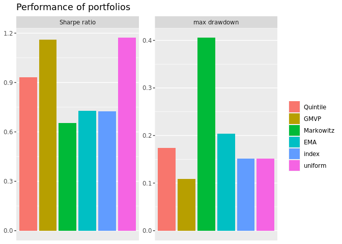
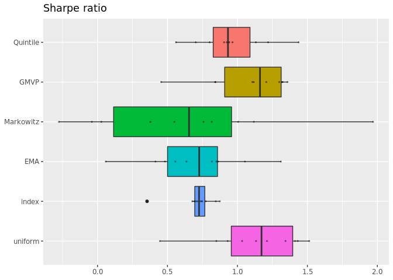
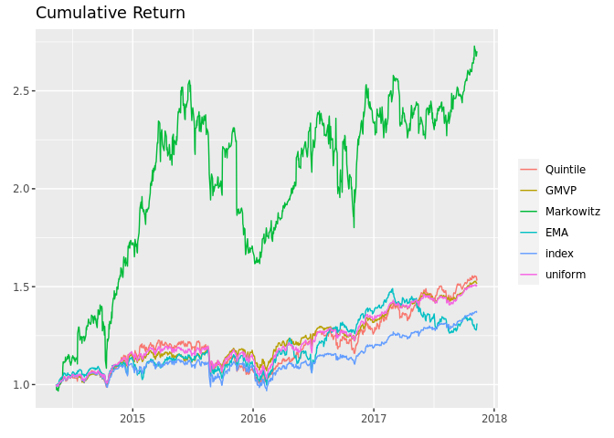
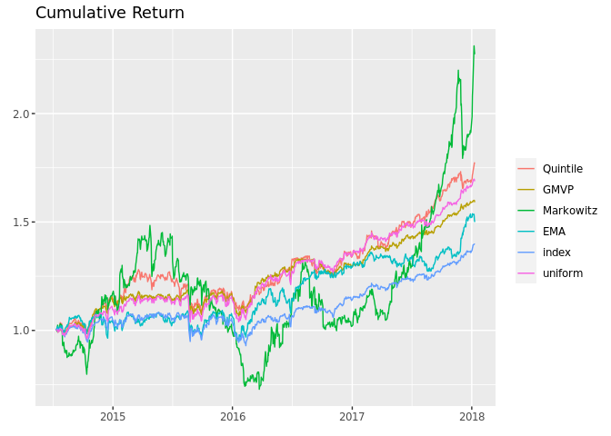
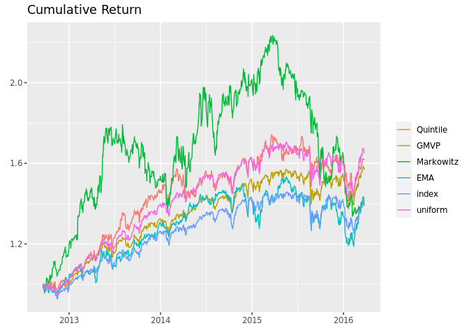
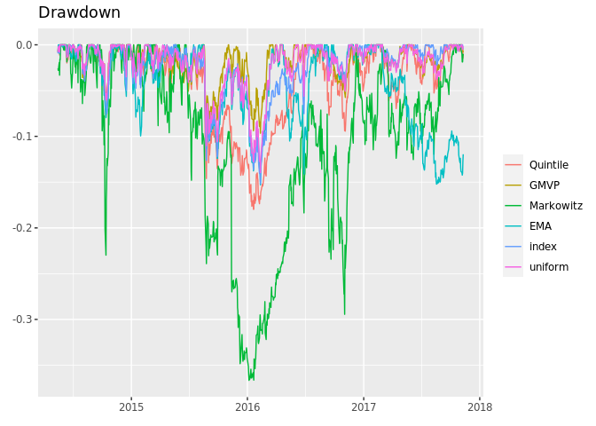
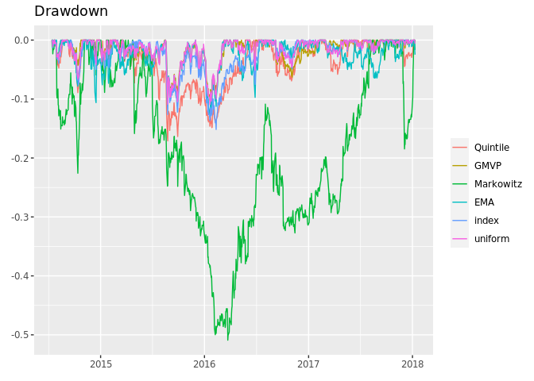
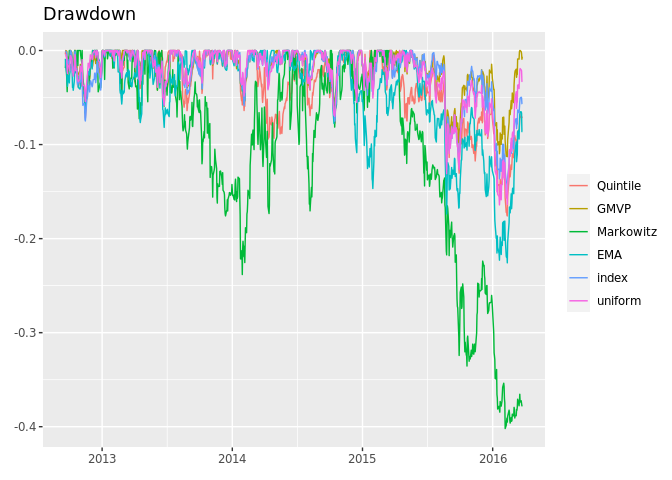

Rolling Window Backtesting
================
Alex Kong
3/15/2021

``` r
# Important reference:
# https://cran.r-project.org/web/packages/portfolioBacktest/vignettes/PortfolioBacktest.html
library(portfolioBacktest)
data("SP500_symbols")
#SP500 <- stockDataDownload(stock_symbols = SP500_symbols,
#                           from = "2007-01-01",
#                           to = "2008-12-31")

load("stockdata_from_2010-01-01_to_2020-12-31_(065fe3c9e1991cd1ec13c8d1c18d3e2c).RData")
SP500 <- stockdata
my_dataset_list <- financialDataResample(
                      SP500, 
                      N_sample = 50,
                      T_sample = 252 * 4, # Desired length of each resample
                      num_datasets = 10)
```

    ## 10 datasets resampled (with N = 50 instruments and length T = 1008) from the original data between 2010-01-04 and 2020-12-30.

``` r
#head(my_dataset_list$`dataset 1`, n = 2)
```

``` r
#head(my_dataset_list$`dataset 3`, n = 2)
```

``` r
library(pracma)
library(nsprcomp)
ema_cross_fun <- function(dataset) {
  
  ema_s <- apply(X = dataset$adjusted, MARGIN = 2, movavg, n = 252/12, type = "e")
  ema_l <- apply(X = dataset$adjusted, MARGIN = 2, movavg, n = 252/2 - 1, type = "e")
  TT <- nrow(dataset$adjusted)
  N <- ncol(dataset$adjusted)
  
  diff <- (ema_l[TT,] - ema_s[TT,])
  diff[diff > 0] <- 1
  diff[diff < 0] <- 0
  w <- rep(1/cardinality(diff), N)
  w <- diff * w
  return(w)
}

# define quintile portfolio
quintile_portfolio_fun <- function(dataset) {
  X <- diff(log(dataset$adjusted))[-1]  # compute log returns
  N <- ncol(X)
  # design quintile portfolio
  ranking <- sort(colMeans(X), decreasing = TRUE, index.return = TRUE)$ix
  w <- rep(0, N)
  w[ranking[1:round(N/5)]] <- 1/round(N/5)
  return(w)
}

# define GMVP (with heuristic not to allow shorting)
GMVP_portfolio_fun <- function(dataset) {
  X <- diff(log(dataset$adjusted))[-1]  # compute log returns
  Sigma <- cov(X)  # compute SCM
  # design GMVP
  w <- solve(Sigma, rep(1, nrow(Sigma)))
  w <- abs(w)/sum(abs(w))
  return(w)
}

# define Markowitz mean-variance portfolio
library(CVXR)
```

    ## 
    ## Attaching package: 'CVXR'

    ## The following objects are masked from 'package:pracma':
    ## 
    ##     conv, grad, size

    ## The following object is masked from 'package:stats':
    ## 
    ##     power

``` r
Markowitz_portfolio_fun <- function(dataset) {
  X <- diff(log(dataset$adjusted))[-1]  # compute log returns
  mu <- colMeans(X)  # compute mean vector
  Sigma <- cov(X)  # compute the SCM
  # design mean-variance portfolio
  w <- Variable(nrow(Sigma))
  prob <- Problem(Maximize(t(mu) %*% w - 0.5*quad_form(w, Sigma)),
                  constraints = list(w >= 0, sum(w) == 1))
  result <- solve(prob)
  return(as.vector(result$getValue(w)))
}
```

``` r
portfolios <- list("Quintile"  = quintile_portfolio_fun,
                   "GMVP"      = GMVP_portfolio_fun,
                   "Markowitz" = Markowitz_portfolio_fun,
                   "EMA"       = ema_cross_fun)
bt <- portfolioBacktest(portfolio_funs = portfolios, 
                        dataset_list = my_dataset_list,
                        benchmark = c("uniform", "index"),
                        T_rolling_window = 252/2,
                        rebalance_every = 10,
                        optimize_every = 30,
                        paral_datasets = 2,
                        show_progress_bar = FALSE, # Does not work in Rstudio
                        cost = list(buy = 0.003,
                                    sell = 0.003,
                                    short = 0.01,
                                    long_leverage = 0.01))
```

    ## 
    ##  [Backtesting 4 portfolios over 10 datasets (periodicity = daily data)]

    ## 
    ##  [Backtesting 1 portfolios over 10 datasets (periodicity = daily data)]

``` r
res <- backtestSelector(bt, portfolio_name = "EMA")
# information of 1st error
#error1 <- res$error_message[[1]]
#str(error1)
```

``` r
backtestTable(bt, measures = c("Sharpe ratio", "max drawdown"))
```

    ## $`Sharpe ratio`
    ##             Quintile      GMVP   Markowitz        EMA     index   uniform
    ## dataset 1  0.9046279 1.1068645  1.00509385 0.55578908 0.6930588 1.0332848
    ## dataset 2  1.2189175 1.3577293  0.81711169 0.81802286 0.7472565 1.3439470
    ## dataset 3  0.9412950 1.1168209  0.37708646 0.63568057 0.6771712 1.1328338
    ## dataset 4  1.1316630 1.3237701  0.02778012 0.84865346 0.8736252 1.5131920
    ## dataset 5  0.9645700 1.2061970 -0.27590865 1.31092928 0.7379474 1.2114208
    ## dataset 6  0.7027233 0.8427863 -0.04053926 0.48216839 0.7007492 0.8492699
    ## dataset 7  1.4369937 1.3172697  1.96909557 0.86054420 0.8453045 1.4311791
    ## dataset 8  0.8009990 0.4550632  0.75794465 0.05873874 0.3542384 0.4464432
    ## dataset 9  0.9236096 1.2984236  0.55015959 1.05357837 0.7733940 1.4120786
    ## dataset 10 0.5608234 0.8411105  1.11738994 0.41415981 0.7135885 0.9304796
    ## 
    ## $`max drawdown`
    ##             Quintile       GMVP Markowitz       EMA     index   uniform
    ## dataset 1  0.1796865 0.09687214 0.3665522 0.1529229 0.1516195 0.1395477
    ## dataset 2  0.1708679 0.10175758 0.5090435 0.1308518 0.1516195 0.1092991
    ## dataset 3  0.1759028 0.11289400 0.4019613 0.2257574 0.1516195 0.1641497
    ## dataset 4  0.1127897 0.10023515 0.4090268 0.1821564 0.1516195 0.1137948
    ## dataset 5  0.2065126 0.18211616 0.5939833 0.3188914 0.2070225 0.2251459
    ## dataset 6  0.1715597 0.16775376 0.4550594 0.2268099 0.1516195 0.1863348
    ## dataset 7  0.1291343 0.10184950 0.2826077 0.1526808 0.1516195 0.1214939
    ## dataset 8  0.3826301 0.36385723 0.5554023 0.4383491 0.3610264 0.3790501
    ## dataset 9  0.1395282 0.10530476 0.3253481 0.1782613 0.1262859 0.1142220
    ## dataset 10 0.2365368 0.16818145 0.3150563 0.2858325 0.1516195 0.1896890

``` r
res_sum <- backtestSummary(bt)
names(res_sum)
```

    ## [1] "performance_summary" "error_message"

``` r
#> [1] "performance_summary" "error_message"

res_sum$performance_summary
```

    ##                       Quintile         GMVP    Markowitz          EMA
    ## Sharpe ratio      9.324523e-01 1.161509e+00   0.65405212   0.72685172
    ## max drawdown      1.737312e-01 1.090994e-01   0.40549404   0.20395690
    ## annual return     1.623726e-01 1.400781e-01   0.22273126   0.11063788
    ## annual volatility 1.559049e-01 1.228132e-01   0.32533403   0.15854582
    ## Sterling ratio    8.876015e-01 1.262267e+00   0.52674835   0.59362132
    ## Omega ratio       1.177018e+00 1.222833e+00   1.14800761   1.13892987
    ## ROT (bps)         2.116502e+02 2.610618e+02 260.68357299 136.64052577
    ## VaR (0.95)        1.568567e-02 1.279179e-02   0.02847022   0.01631653
    ## CVaR (0.95)       2.242995e-02 1.764404e-02   0.04612536   0.02226504
    ## cpu time          1.266667e-03 1.766667e-03   0.26558333   0.02195000
    ## failure rate      0.000000e+00 0.000000e+00   0.00000000   0.00000000
    ##                        index      uniform
    ## Sharpe ratio      0.72576793 1.172127e+00
    ## max drawdown      0.15161946 1.518487e-01
    ## annual return     0.09083729 1.576252e-01
    ## annual volatility 0.12522295 1.339365e-01
    ## Sterling ratio    0.58851653 9.460187e-01
    ## Omega ratio       1.14604075 1.224134e+00
    ## ROT (bps)                Inf 2.152163e+03
    ## VaR (0.95)        0.01340770 1.379769e-02
    ## CVaR (0.95)       0.01903363 1.951635e-02
    ## cpu time          0.00000000 1.150000e-03
    ## failure rate      0.00000000 0.000000e+00

``` r
summaryTable(res_sum, type = "DT", order_col = "Sharpe ratio", order_dir = "desc")
```

    ## PhantomJS not found. You can install it with webshot::install_phantomjs(). If it is installed, please make sure the phantomjs executable can be found via the PATH variable.

<div id="htmlwidget-47abee4022f6b0a75e85" style="width:100%;height:auto;" class="datatables html-widget"></div>
<script type="application/json" data-for="htmlwidget-47abee4022f6b0a75e85">{"x":{"filter":"none","caption":"<caption>Performance table<\/caption>","data":[["Quintile","GMVP","Markowitz","EMA","index","uniform"],[0.9325,1.1615,0.6541,0.7269,0.7258,1.1721],[0.1737,0.1091,0.4055,0.204,0.1516,0.1518],[0.1624,0.1401,0.2227,0.1106,0.0908,0.1576],[0.1559,0.1228,0.3253,0.1585,0.1252,0.1339],[0.8876,1.2623,0.5267,0.5936,0.5885,0.946],[1.177,1.2228,1.148,1.1389,1.146,1.2241],[211.6502,261.0618,260.6836,136.6405,null,2152.1627],[0.0157,0.0128,0.0285,0.0163,0.0134,0.0138],[0.0224,0.0176,0.0461,0.0223,0.019,0.0195],[0.0013,0.0018,0.2656,0.0219,0,0.0011],[0,0,0,0,0,0]],"container":"<table class=\"display\">\n  <thead>\n    <tr>\n      <th> <\/th>\n      <th>Sharpe ratio<\/th>\n      <th>max drawdown<\/th>\n      <th>annual return<\/th>\n      <th>annual volatility<\/th>\n      <th>Sterling ratio<\/th>\n      <th>Omega ratio<\/th>\n      <th>ROT (bps)<\/th>\n      <th>VaR (0.95)<\/th>\n      <th>CVaR (0.95)<\/th>\n      <th>cpu time<\/th>\n      <th>failure rate<\/th>\n    <\/tr>\n  <\/thead>\n<\/table>","options":{"pageLength":10,"scrollX":true,"order":[1,"desc"],"columnDefs":[{"targets":2,"render":"function(data, type, row, meta) {\n    return type !== 'display' ? data : DTWidget.formatPercentage(data, 1, 3, \",\", \".\");\n  }"},{"targets":4,"render":"function(data, type, row, meta) {\n    return type !== 'display' ? data : DTWidget.formatPercentage(data, 1, 3, \",\", \".\");\n  }"},{"className":"dt-right","targets":[1,2,3,4,5,6,7,8,9,10,11]},{"orderable":false,"targets":0}],"autoWidth":false,"orderClasses":false,"rowCallback":"function(row, data) {\nvar value=data[0]; $(row).css({'font-weight':value == \"uniform\" ? \"bold\" : value == \"index\" ? \"bold\" : null});\n}"}},"evals":["options.columnDefs.0.render","options.columnDefs.1.render","options.rowCallback"],"jsHooks":[]}</script>

``` r
summaryBarPlot(res_sum, measures = c("Sharpe ratio", "max drawdown"))
```

<!-- -->

``` r
backtestBoxPlot(bt, measure = "Sharpe ratio")
```

<!-- -->
\#\# Cumulative Returns {.tabset}

### Dataset 1

``` r
backtestChartCumReturns(bt = bt, dataset_num = 1)
```

<!-- -->

### Dataset 2

``` r
backtestChartCumReturns(bt = bt, dataset_num = 2)
```

<!-- -->

### Dataset 3

``` r
backtestChartCumReturns(bt = bt, dataset_num = 3)
```

<!-- -->

## 

## Maximum Drawdown

### Dataset 1

``` r
backtestChartDrawdown(bt = bt, dataset_num = 1)
```

<!-- -->

### Dataset 2

``` r
backtestChartDrawdown(bt = bt, dataset_num = 2)
```

<!-- -->

### Dataset 3

``` r
backtestChartDrawdown(bt = bt, dataset_num = 3)
```

<!-- -->

## 

``` r
# for better illustration, let's use only the first 5 stocks
my_dataset_list_10stocks <- lapply(my_dataset_list, 
                            function(x) {x$adjusted <- x$adjusted[, 1:20]; return(x)})
# backtest
bt <- portfolioBacktest(list("EMA" = ema_cross_fun), my_dataset_list_10stocks, 
                        rebalance_every = 30,
                        optimize_every = 30,
                        T_rolling_window = 252/2)
backtestChartStackedBar(bt, "EMA", legend = TRUE)
```
